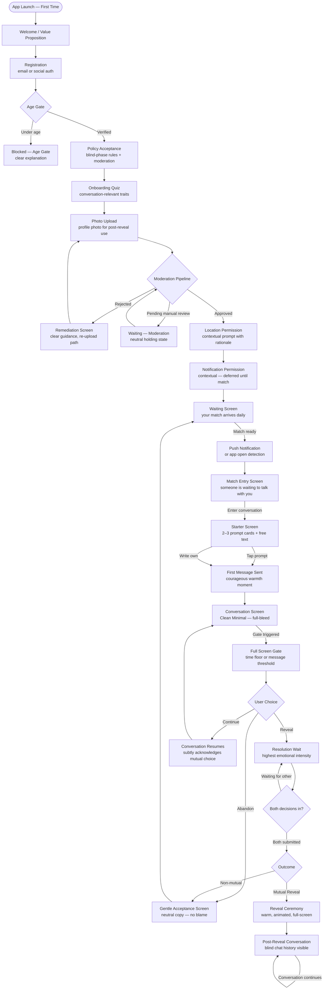
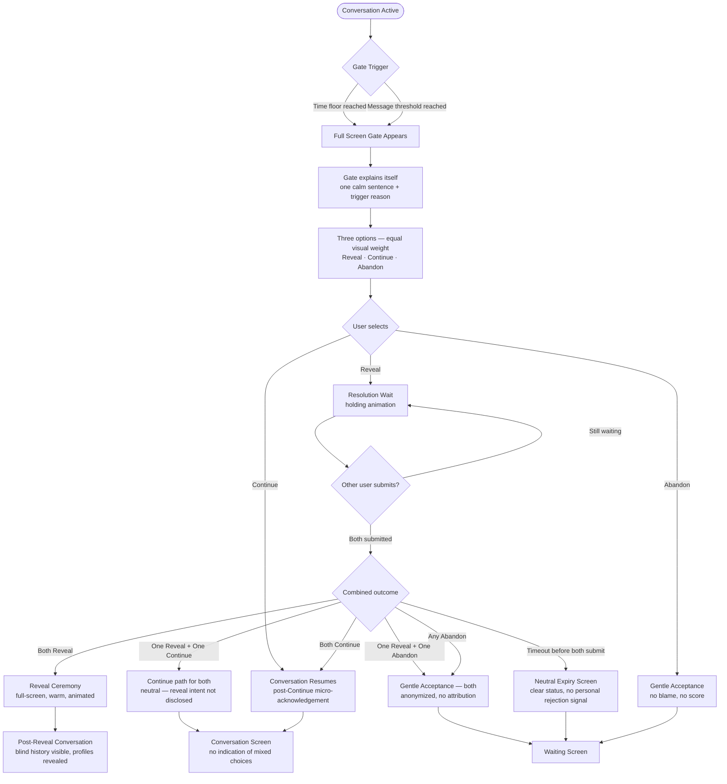
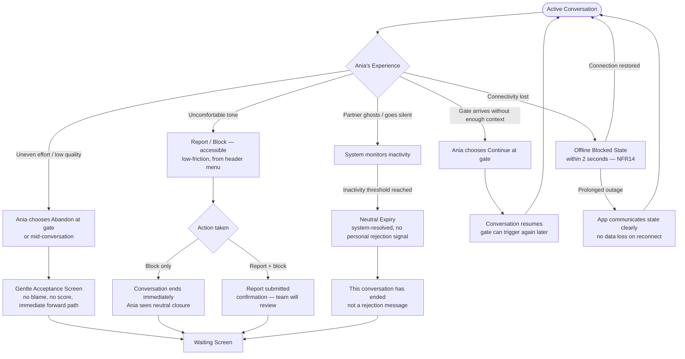

# UX Design Specification Blinder

**Author:** Piotr.palej
**Date:** 2026-04-03

---

## Design System Packaging

This specification is the authoring source for the Blinder design system. It has been packaged into implementation-ready artefacts that stay in lockstep with this document:

| Artefact | Purpose |
|---|---|
| [`README.md`](./README.md) | Written spec \u2014 voice, tone, tokens, copy rules, component inventory |
| [`SKILL.md`](./SKILL.md) | Core invariants \u2014 quick-reference rules for any new work |
| [`colors_and_type.css`](./colors_and_type.css) | CSS variables packaging every colour, type, spacing, radius, shadow, and motion token from this spec \u2014 the web / HTML-prototype source of truth |
| [`ui_kits/Blinder/`](./ui_kits/Blinder/) | Live JSX component showcase implementing every component section below |
| [`blinder-clickable-prototype.html`](./blinder-clickable-prototype.html) | Original interactive prototype, now re-pointed to `colors_and_type.css` |

The Tamagui token implementation specified below must match these packaged CSS variables one-to-one. When a downstream doc (PRD, epics, architecture) disagrees with the rules here, this spec plus the artefacts above are the source of truth.

<!-- UX design content will be appended sequentially through collaborative workflow steps -->

## Executive Summary

### Project Vision

Blinder inverts the standard dating app sequence — conversation first, photos hidden until a mutual decision is made. The core promise is *dignity before desirability*: users are evaluated through interaction quality before visual filtering enters the picture. This is structural differentiation, not a feature layer. The product is not a better swipe feed — it is a different first-impression protocol that restores user agency and shifts outcomes toward controllable behavior rather than static appearance traits.

### Target Users

**Marek (29)** — Thoughtful, often filtered out by photo-first mechanics. Wants to be heard before judged. Comes to Blinder seeking a fair first chance through dialogue.

**Ania (27)** — Safety-sensitive, emotionally intentional, low tolerance for pressure or manipulation. Needs strong control over emotional risk and a product that actively prevents unsafe dynamics.

**Broader psychographic:** Polish users fatigued by swipe-first dynamics, rejection loops, and status-heavy UX — people who believe fairness and authentic conversation should come before visual judgment.

### Key Design Challenges

1. **Identity-based onboarding** — The no-photo rule must feel like a *values choice the user is making*, not a product limitation. Onboarding initiates a belief ("I am someone who values fairness and conversation") rather than just explaining a rule. This is narrative design, not feature explanation.

2. **Perceived liquidity UX** — The most dangerous early-market challenge. When matches are sparse at launch, the product must communicate "quality over quantity" without reading as "we can't find you anyone." The liquidity anxiety loop (low match frequency → disengagement → smaller pool → lower quality) must be interrupted through intentional UX framing at every waiting touchpoint.

3. **Decision gate communication** — The gate must be crystal clear (what it is, why it appeared, what each option means) without inducing pressure or anxiety. This is the product's most unique and risky UX moment.

4. **Gate interruption UX** — One user may be ready to decide while the other is deep in conversation. The transition from "we're just talking" to "now you must choose" is jarring if not handled with intentional design. This is an asymmetric experience that needs its own framing.

5. **Dignified ending language** — Non-mutual endings must be handled with neutral, non-rejection-coded copy and UI. One wrong word breaks trust.

6. **Re-entry psychology after endings** — The moment a user returns to the match queue after a conversation ends is trust-critical. If users feel they *failed* even without explicit rejection signaling, the product has not solved the rejection loop — it has only hidden it.

### Design Opportunities

1. **Identity-first onboarding** — Successfully instilling "I am the kind of person who values conversation over looks" creates a retention mechanism rooted in personal values, not notification pressure.

2. **The waiting state as anticipation ritual** — The daily match cadence should feel like *looking forward to something*, not absence. Preparation rituals (reviewing conversation starters, reflecting on what you're seeking) can reinforce the product's values while users wait.

3. **The reveal moment as ceremony** — The mutual reveal is a unique, emotionally significant product event with no competitor precedent. It can be designed as a meaningful ceremony rather than a mechanical state change.

4. **Anti-urgency as visual identity** — Genuinely calm UI is a real differentiator. Typography, color, micro-copy, and motion can all reinforce the "no pressure" brand in ways mainstream apps structurally cannot replicate.

5. **Conversation-in-context** — Showing the blind conversation history during and after reveal creates a shared narrative artifact that deepens emotional attachment and reinforces the "we connected before visuals" trust signal.

## Core User Experience

### Defining Experience

Blinder's core experience is a **two-rhythm loop**: a daily matching rhythm (one carefully surfaced match per cycle) feeding into an ongoing conversational rhythm (blind messaging with a structured endpoint). Neither rhythm is subordinate — matching without quality conversation is empty, and conversation without a meaningful path to decision is aimless. The two rhythms must feel connected and purposeful together.

The app's primary activity, by time and frequency, is **reading and writing messages** in the blind phase. Everything else — onboarding, matching, the gate, the reveal — supports or frames that central act.

### Platform Strategy

- **Platforms:** iOS and Android, phone form factor only. No tablet support in MVP.
- **Input model:** Touch-first throughout. All interactions designed for one-handed thumb reachability where possible.
- **Native capabilities:** Push notifications (APNS/FCM) and precise location for matching. No additional native integrations in MVP.
- **Connectivity:** Offline support is explicitly out of scope. The app communicates clearly and calmly when connectivity is unavailable and blocks core write actions until restored.

### Effortless Interactions

The **entire path from registration to first active conversation must be zero-friction**. This is the product's most important effortless zone. Every step in onboarding — account creation, quiz completion, permissions, policy acceptance, and profile upload — must feel like natural forward momentum, not a checklist to endure. Users should arrive at their first conversation feeling prepared and willing, not depleted.

Secondary effortless areas:
- Sending a message (always one tap away from the conversation screen)
- Understanding current app state (what's active, what's waiting, what needs attention)
- Abandoning a conversation that isn't working — exit must be low-friction and shame-free

### Critical Success Moments

**The decision gate** is the product's most critical interaction to get right. It must be:
- **Contextually clear** — the user understands exactly why the gate appeared (time floor or message threshold), without needing to re-read instructions
- **Emotionally grounded** — the user feels they have enough context to make a genuine choice, not a forced snap decision
- **Pressure-free** — the visual language, copy, and timing all signal that this is a meaningful pause, not a countdown

**The reveal** is the interaction that must be *perfect*. It is the product's highest emotional peak — the moment the promise of "conversation before appearance" is fulfilled. It must feel like a ceremony: intentional, warm, and earned. The transition from blind conversation to revealed profile must carry the weight of the shared history that preceded it. This is where Blinder either delivers on its core promise or breaks it.

### Experience Principles

1. **Forward momentum, not friction** — Every flow should feel like natural progress. Onboarding especially must carry users forward, not gate them.
2. **Meaning before motion** — The decision gate and reveal exist to create meaningful moments, not mechanical state changes. Design them as experiences, not transitions.
3. **Calm as default** — No urgency, no pressure, no status anxiety. The visual and copy language should consistently signal that the user is in control and there is no rush.
4. **Transparency without exposure** — Users always know the state of their conversation and why things are happening, without ever exposing the counterpart's private signals or decisions.
5. **Shame-free exits** — Abandoning a conversation must be as dignified as staying. The product never penalizes or stigmatizes disengagement.

## Desired Emotional Response

### Primary Emotional Goals

Blinder's emotional north star is a **trio of feelings that build on each other**:

1. **Satisfaction** — Users leave a conversation feeling the interaction was genuine and worth their time, regardless of outcome. Not a hit of dopamine, but a quiet sense of quality.
2. **Happiness at reveal** — When mutual reveal happens, users feel warm joy and a sense of shared achievement. Emotionally loaded but not overwhelming — a meaningful moment that feels earned and celebratory, shared between two people.
3. **Hope** — The lasting emotional residue of using Blinder is forward-looking optimism. Users believe their next connection is possible and worth waiting for.

The story Marek tells a friend is: *"I finally had a meaningful conversation with someone cool."* This is the product's word-of-mouth unit — not "I matched with someone hot," not "I got a lot of likes," but the quality and authenticity of the human connection.

### Emotional Journey Mapping

| Stage | Desired Emotion | Notes |
|---|---|---|
| First discovery / onboarding | Intrigue + quiet confidence | "This is different. I think I belong here." |
| Waiting for a match | Calm anticipation | Requires a temporal anchor — ambiguous wait becomes anxiety in disguise |
| First message sent | Courageous warmth | A vulnerable, authentic leap; deserves its own named design moment |
| Active blind conversation | Engagement + ease | Absorbed in genuine exchange; no performance pressure |
| Approaching the decision gate | Grounded readiness | Enough context to choose; no panic, no rush |
| Resolution wait (after submitting gate choice) | Charged anticipation | Highest emotional intensity in the product; distinct from the gate itself |
| Mutual reveal | Warm joy + shared celebration | Emotionally loaded but not overwhelming; a moment to savour together |
| Non-mutual ending | Gentle acceptance | "It's okay, it happens. It wasn't meant to be this time." Forward-looking, no blame, no self-worth penalty |
| Re-entering the match queue | Renewed hope | Requires a signal of progress from the system — not manufactured positivity |
| Returning to the app (repeat use) | Earned trust | Evolves from comfort to trust as the product demonstrates it knows the user |

### Micro-Emotions

**To cultivate:**
- **Satisfaction** over stimulation — the reward is conversational depth, not match volume
- **Anticipation** over anxiety — waiting feels purposeful, not empty
- **Agency** — users always feel in control of their choices and pace
- **Warmth** — the app feels like it's rooting for the user, not optimising against them
- **Relief** — especially after a non-mutual ending; the absence of blame is itself emotionally restorative
- **Courageous warmth** — the feeling of choosing to show up authentically despite uncertainty (first message moment)

**To eliminate:**
- **Quick dopamine hits** — no streak rewards, no vanity metrics, no engagement bait
- **Guilt** — no feeling of having "wasted" a match or "failed" a conversation
- **Sadness** — non-mutual endings must land as gentle closure, never as loss or rejection
- **Anxiety** — no countdown pressure, no competitive scarcity framing, no urgency signals
- **Shame** — abandoning a conversation must feel as dignified as completing one
- **Manufactured positivity** — "it'll be fine" copy without behavioral evidence erodes trust over repeated low-quality outcomes

### Design Implications

| Emotional Goal | UX Design Approach |
|---|---|
| Satisfaction from conversations | Conversation starters that invite depth; no character limits that truncate thought |
| Calm anticipation during waiting | Purposeful waiting state with temporal anchor ("your match arrives daily") — not a spinner or empty screen |
| Courageous warmth at first message | Subtle encouragement at the send-first-message moment; acknowledge the vulnerability of going first |
| Warm joy at reveal | Animated, unhurried reveal transition — visually celebratory without being loud |
| Charged anticipation at resolution wait | Distinct micro-animation or holding state between gate submission and outcome delivery |
| Gentle acceptance at endings | Neutral, compassionate copy with no scoring, no metrics, immediate forward path |
| Renewed hope at re-entry | System signal of improvement ("we're finding you better matches") — not just encouraging copy |
| No dopamine hits | Zero streak indicators, counters, or engagement nudges anywhere in the product |
| Agency at decision gate | All three options (Reveal / Continue / Abandon) presented with equal visual weight — no default highlighted |

### Emotional Design Principles

1. **Quality over stimulation** — every design decision should deepen the experience, not accelerate it.
2. **Anticipation is a feature** — the waiting between moments is part of the emotional rhythm; anchor it in time and design it intentionally.
3. **The reveal is a ceremony, not a button** — the product's highest emotional moment must be treated as such in every design layer: motion, copy, pacing, shared context.
4. **Endings are not failures** — non-mutual outcomes must be designed with the same care as successes. Graceful closure is a trust signal.
5. **The app is on the user's side** — demonstrated through behavioral evidence over time, not just copy tone. Earned trust grows through repeated proof, not reassurance.

## UX Pattern Analysis & Inspiration

### Inspiring Products Analysis

#### Flughafen Zürich (Zurich Airport Website)

**What it does well:** Internationally recognised for simplicity, readability, and passenger-oriented wayfinding. Users in a high-stress, high-stakes context (travel) are guided calmly through each stage of their journey without ever feeling lost or overwhelmed. The information hierarchy is precise — you always see exactly what you need at the exact moment you need it, and nothing else.

**What makes it compelling:**
- **Journey-stage UX**: The interface understands where you are in your journey and surfaces only what's relevant to that stage.
- **Calm authority**: Information is presented with quiet confidence — no urgency, no noise, no decorative complexity.
- **Progressive disclosure**: Complexity is revealed gradually, only when needed.
- **Wayfinding clarity**: At every point, the user knows where they are, what comes next, and what they need to do.

#### WhatsApp

**What it does well:** The gold standard for communication-first interface design. The conversation *is* the interface — nothing competes with it. Messaging feels natural, fast, and completely frictionless.

**What makes it compelling:**
- **Feature minimalism**: Every element present earns its place. Nothing decorative, nothing performative.
- **Conversation primacy**: The message thread is the entire product. Everything else is subordinate to it.
- **Reliability as trust**: The product just works. That consistency builds deep, low-maintenance trust.
- **Zero social performance layer**: No likes, no public audience. The conversation exists between two people, privately.

### Transferable UX Patterns

**Navigation & Wayfinding:**
- **Journey-stage navigation** *(from Zürich)* — Surface only what's relevant to the user's current phase: waiting, conversation, gate, or post-outcome. Don't mix phase contexts in the same screen.
- **Progressive disclosure** *(from Zürich)* — Reveal complexity incrementally. Gate mechanics and reveal rules should be explained contextually, not front-loaded in onboarding.

**Interaction Patterns:**
- **Conversation primacy** *(from WhatsApp)* — The blind conversation screen is the cleanest screen in the product. Nothing competes with the exchange. Metadata and status indicators are secondary and recede.
- **Calm authority copy** *(from Zürich)* — All instructional and status copy uses quiet confidence. Clear, short, no second-guessing the user.

**Visual Patterns:**
- **Minimal visual hierarchy** *(from both)* — Typography and layout reduce cognitive load. Readable, spacious, purposeful.
- **Stage-appropriate UI** *(from Zürich)* — Visual design shifts subtly between phases to signal context change without jarring transitions.

### Anti-Patterns to Avoid

- **Feature accumulation** — Adding features to signal progress. Every addition should pass the WhatsApp test: does this earn its presence?
- **Information front-loading** — Showing all rules and mechanics before the user needs them. Novel mechanics should be explained just-in-time.
- **Anxiety-inducing status indicators** — Real-time signals like "typing…" or "last seen" can create performance pressure. Evaluate each status signal for anxiety potential before including.
- **Navigation complexity** — Any flow that requires learning the app before using it conflicts with the zero-friction path to first conversation.

### Design Inspiration Strategy

**Adopt directly:**
- Journey-stage UI — show only what's relevant to the current phase
- Conversation-first screen design — the message thread is the product
- Progressive disclosure for onboarding and gate mechanics

**Adapt:**
- Zürich's calm authority tone → Blinder's compassionate, warm tone (same clarity, more humanity)
- WhatsApp's feature minimalism → applied to emotional moments (the reveal deserves more ceremony, but no more features)

**Avoid:**
- Real-time status indicators that could create comparison or performance pressure
- Feature additions that don't serve the core loop
- Front-loaded complexity in onboarding

## Design System Foundation

### Design System Choice

**Tamagui** on React Native (iOS + Android), with a custom design token layer defining Blinder's visual identity. Web version is planned as a future separate codebase, with Tamagui's cross-platform token architecture making design decisions transferable without requiring a shared implementation.

### Rationale for Selection

- **Full token control** — Blinder's anti-urgency visual identity (NFR28) requires complete control over colour, typography, spacing, and motion. Tamagui's theme system supports this without fighting the framework.
- **Animation primitives** — The reveal ceremony, gate transition, and other emotionally significant moments require fine-grained, performant animation. Tamagui's animation layer handles this natively.
- **Performance** — Tamagui compiles static styles at build time. Note: dynamic paths (reveal states, gate card states) fall back to runtime evaluation — performance is strong but the static compilation benefit applies to static style paths only.
- **Web transferability** — When a web version is built as a separate codebase, design tokens, theme definitions, and component APIs will transfer directly — reducing design debt without mandating a shared implementation.
- **Feature minimalism alignment** — Tamagui encourages composable, token-driven components over opinionated pre-styled libraries. Aligns with the anti-pattern of avoiding defaults that impose unwanted visual character.

### Implementation Approach

- **Design tokens first — hard gate** — Token architecture (colour, typography, spacing, border radius, shadow, motion curves) must be locked and reviewed before any screen implementation begins. No hardcoded values permitted at any stage.
- **Motion prototype before token lock** — The reveal ceremony and gate transition must be prototyped and *felt* before motion tokens are specified. Small timing differences (50–100ms) have significant emotional impact at these moments.
- **Motion vocabulary spec** — Define upfront: what animates, at what speed, with what easing, and which emotional moments are *in-screen animations* (Tamagui handles natively) vs. *navigation-level transitions* (require react-native-reanimated or native driver coordination). This boundary must be clear before component work begins.
- **Theme variants** — Light theme as MVP; dark theme as a post-MVP token swap with no component changes required.
- **Custom components** — Build only for Blinder-specific UI: conversation bubble, gate card, reveal transition, offline blocked state overlay, and blind-phase avatar placeholder.

### Blind-Phase Avatar Placeholder

This component warrants dedicated design attention. It is present on every conversation screen during the blind phase and is the visual representation of a person the user cannot see. It sets the emotional tone of the entire blind experience and must reinforce warmth and dignity — not feel like a broken image or a generic silhouette. Design options to explore: abstract warmth (soft gradient shape), initial-based (first letter of a generated name), or illustrated (a consistent illustrated character style). The chosen approach must align with the product's calm, human-first visual language.

### Customization Strategy

| Token Category | Direction |
|---|---|
| Colour palette | Warm neutrals as base; no high-saturation accents in trust-critical flows — enforced as a design review gate |
| Typography | High readability at conversation density; generous line height; no condensed fonts |
| Spacing | Generous — breathing room reinforces the no-pressure tone |
| Border radius | Soft — rounded corners signal approachability |
| Motion | Slow and intentional for emotional moments (reveal, gate); near-instant for utility actions — timing validated through prototype before token lock |
| Shadows / elevation | Minimal — avoid depth cues that create visual hierarchy anxiety |

## Visual Design Foundation

### Color System

**Base palette — Warm Dusk:**

| Token | Value | Usage |
|---|---|---|
| `color.bg.base` | `#FBF5EE` | App background, all screens |
| `color.bg.surface` | `#EDE3D8` | Cards, input fields, bubbles (incoming) |
| `color.bg.elevated` | `#F5EDE2` | Modal surfaces, gate card background |
| `color.primary` | `#8B4E6E` | Primary actions, outgoing message bubbles, send button |
| `color.primary.light` | `#B87A98` | Pressed states, secondary emphasis |
| `color.reveal` | `#D4A85A` | Reserved exclusively for the reveal ceremony — Reveal button, mutual reveal screen accent |
| `color.accent` | `#C4825A` | Conversation starters, secondary CTAs, links |
| `color.text.primary` | `#2C1C1A` | All primary text |
| `color.text.secondary` | `#7A5A52` | Timestamps, status text, subtitles |
| `color.text.muted` | `#A08878` | Placeholder text, hints |
| `color.border` | `#DDD0C4` | Dividers, input borders |
| `color.error` | `#B85050` | Inline error states only |
| `color.offline` | `#9A9090` | Offline blocked state |

**Semantic rules:**
- `color.reveal` is used **nowhere except the reveal ceremony and the Reveal button at the gate**. Its visual distinctiveness must be preserved.
- No high-saturation colours anywhere in trust-critical flows.
- Dark backgrounds (`#2C1C1A`) used only for gate overlay backdrop and offline full-screen states.

**Accessibility:** All primary text/background combinations target WCAG 2.1 AA contrast (≥4.5:1). To be validated against final rendered values.

### Typography System

**Typeface:** Lato — Light (300), Regular (400), Bold (700), Black (900)

| Scale Token | Weight | Size | Line Height | Usage |
|---|---|---|---|---|
| `text.display` | Black 900 | 32px | 1.2 | Reveal ceremony heading only |
| `text.h1` | Bold 700 | 24px | 1.3 | Screen titles, onboarding headings |
| `text.h2` | Bold 700 | 20px | 1.35 | Section headings, gate card title |
| `text.h3` | Bold 700 | 17px | 1.4 | Subsection labels, conversation header name |
| `text.body` | Regular 400 | 15px | 1.65 | Message bubbles, body copy |
| `text.body.sm` | Regular 400 | 13px | 1.6 | Conversation starter prompts, secondary content |
| `text.caption` | Light 300 | 11px | 1.5 | Timestamps, status labels |
| `text.button` | Bold 700 | 14px | 1 | All button labels |

**Principles:**
- Generous line height (1.6–1.65 for body) — supports readability and reinforces the no-rush tone
- No italics in trust-critical flows
- Letter spacing: default (0) for body; `+0.04em` for button labels and captions only

### Spacing & Layout Foundation

**Base unit:** 8px. All spacing values are multiples.

| Token | Value | Usage |
|---|---|---|
| `space.xs` | 4px | Icon gaps, inline tight spacing |
| `space.sm` | 8px | Between related elements (bubble + timestamp) |
| `space.md` | 16px | Standard padding, between conversation bubbles |
| `space.lg` | 24px | Screen horizontal padding, section gaps |
| `space.xl` | 32px | Between major layout sections |
| `space.2xl` | 48px | Generous screen breathing room (onboarding) |

**Border radius:**

| Token | Value | Usage |
|---|---|---|
| `radius.sm` | 8px | Chips, tags |
| `radius.md` | 14px | Input fields |
| `radius.lg` | 18px | Conversation bubbles |
| `radius.xl` | 20px | Cards, gate card, modals |
| `radius.full` | 9999px | Avatar circles, send button, pill buttons |

**Layout principles:**
- Single column throughout — no multi-column layouts on any phone screen
- Screen horizontal padding: `space.lg` (16px) on both sides, consistently applied
- "Less is more": if a UI element doesn't serve the active user task, it's not visible
- Minimum touch target: 44×44px for all interactive elements
- All layouts respect iOS notch/Dynamic Island and Android system bar insets

### Accessibility Considerations

- **Contrast:** All text/background pairs target WCAG 2.1 AA. Validate on actual rendered frames.
- **Font scaling:** Layout must accommodate up to 1.3× font scale without truncation on trust-critical screens.
- **Focus indicators:** All interactive elements have visible focus rings using `color.primary` outline.
- **Colour independence:** Gate options (Reveal / Continue / Abandon) differentiated by label and position, not colour alone.
- **Motion:** All animations respect `prefers-reduced-motion`. Reveal ceremony falls back to a simple cross-fade.

## Design Direction Decision

### Design Directions Explored

Six directions were explored, all using the Warm Dusk palette and Lato typeface:

1. **Clean Minimal** — WhatsApp-close conversation screen, gate as bottom overlay
2. ~~Warm Context~~ — *Excluded: trait chips visible during blind phase conflict with the conversation-first promise*
3. ~~Tab Navigation~~ — *Excluded: tab bar implies multi-stream attention; Blinder's single-conversation model doesn't warrant it*
4. **Gate Full Screen** — Decision gate as full-screen takeover with options fully described
5. **Starter Forward** — Prominent starter cards before first message; transitions to conversation after first send
6. **Reveal & Ending Screens** — Mutual reveal as ceremony; non-mutual ending with dignified neutral language

### Chosen Direction

A **synthesis of directions 1, 4, 5, and 6**, with a custom navigation approach:

| Screen / State | Direction Applied |
|---|---|
| App navigation structure | Option A: Single-focus, no persistent nav bar |
| Waiting / home state | Custom — single-focus screen, no competing elements |
| Match Entry | Custom interstitial — first impression of an actual match, between Waiting and Starter Screen |
| First-message entry | D5: Starter Forward — prominent starter cards before first send |
| Active blind conversation | D1: Clean Minimal — conversation-first, receding chrome |
| Decision gate | D4: Full Screen — gate takes over entirely, all 3 options fully explained |
| Resolution wait | Named state between gate submission and outcome delivery |
| Mutual reveal | D6: Reveal ceremony — animated, warm, full-screen |
| Non-mutual ending | D6: Gentle acceptance — neutral copy, immediate forward path |
| Account deletion | Explicit confirmation screen within profile settings (GDPR-required) |

### Navigation Architecture

**Option A — Single-focus, no persistent bottom navigation.**

Blinder's daily match model means there is at most one active conversation at a time. There is no inbox of simultaneous matches to browse. The home screen is either the waiting state or the active conversation.

- No bottom tab bar at any point in the app
- Profile and settings accessible via a top-right avatar tap — **must be visually interactive, not passive** (explicit design requirement for new-user orientation)
- Contextual back arrows for all deeper flows
- Navigation chrome disappears entirely during active conversation — full-bleed conversation screen
- Push notifications deep-link into specific states without breaking conversation context

### Navigation State Machine

```
Onboarding (separate flow) → [exit] →
Waiting → Match Entry → Starter Screen → Conversation
                                              ↓
                                            Gate
                                           ↙     ↘
                               Continue       Reveal / Abandon
                                  ↓                  ↓
                           Conversation        Resolution Wait
                           (post-Continue              ↓
                            micro-ack)              Outcome
                                                       ↓
                                                   Waiting
```

**State notes:**
- **Onboarding** is a separate flow (quiz, permissions, photo upload, policy acceptance) with an explicit exit condition into the main state machine
- **Match Entry** — first impression of an actual match; distinct from the waiting screen; needs dedicated design treatment
- **Continue branch** — returns the user to the conversation, not to an outcome screen; conversation header subtly acknowledges "you both chose to keep talking"
- **Resolution Wait** — named state between gate choice submission and outcome delivery; highest emotional intensity moment; requires dedicated animation spec
- **Account Deletion** — lives inside profile settings sheet; requires an explicit confirmation screen with GDPR-compliant copy

### Design Rationale

- D2 excluded — trait chips in the blind phase header give too much contextual information, undermining the conversation-first promise
- Tab bar excluded — persistent multi-destination navigation implies a product with many simultaneous streams; Blinder is intentionally single-conversation-at-a-time
- Gate full-screen (D4) over overlay — the gate is the product's most important decision moment; full-screen gives appropriate ceremony and space to explain each option with dignity
- Starter Forward (D5) as default first-message state — directly addresses the highest-anxiety UX moment: blank page, first message to a stranger

## Defining Core Experience

### Defining Experience

Blinder's defining experience, in one sentence:

> *"Start a real conversation with a stranger — no swiping, no waiting to see if they match back — and discover together where it goes."*

The emotional promise is not the reveal alone. It is the **accumulated experience of quality conversations** — some ending in reveal, some not — that gives users the feeling of a fair system working on their behalf. Marek's story is "I had 3 conversations, two ended in reveal, and we kept talking" — not "I had one perfect reveal." Success is plural and conversational, not singular and visual.

### User Mental Model

Users arrive with a deeply ingrained swipe-first mental model: *see → judge → swipe → wait → match → chat*. The anxiety in this model is distributed across multiple gatekeeping moments — will they swipe right on me? did I match? did they message first?

Blinder breaks this model at a single, sharp point: **the immediate conversation start**. There is no swiping. There is no matching anxiety. The user is placed directly into a conversation with someone. This is both the product's greatest innovation and its highest UX risk — users who expect to *choose* first will feel disoriented when they're asked to *talk* first.

The mental model break should be framed as **liberation, not disorientation**: *"You don't have to win anything to get started here. Just talk."* Onboarding and the first-conversation entry point must actively dissolve the swipe-first anxiety rather than expecting users to self-correct.

### Success Criteria

A successful session looks like one of two outcomes — both are valid, both should feel earned:

1. **Quality conversation without reveal** — the conversation was interesting, the other person felt real, the outcome felt fair and non-judgmental. The user leaves thinking "that was worth it."
2. **Reveal + continued conversation** — mutual reveal happened, both users chose to keep talking. The reveal moment felt meaningful. The conversation didn't lose momentum after it.

**What makes the core interaction feel like it "just works":**
- The user is never confused about what state they're in or what action is available
- The first message is easy to send — the system provides enough conversational scaffolding to remove the blank-page anxiety
- The conversation screen is distraction-free and focused entirely on the exchange
- The gate appears naturally, not as an interruption — the user understands why it appeared
- Whether the outcome is positive or neutral, the user feels the system treated them fairly

### Novel UX Patterns

Blinder's core experience requires user education — it combines familiar patterns (messaging) with genuinely novel ones (no-choice entry, dual-trigger gate, private simultaneous decision). The novel elements cannot be assumed — they must be taught just-in-time.

**Novel patterns requiring explicit framing:**
- **No-choice entry**: The user does not pick their conversation partner. Frame as a feature ("we found someone worth your time"), not a limitation.
- **Dual-trigger gate**: Most users will not understand why a gate appeared mid-conversation. The gate must explain itself — briefly, calmly — at the moment it appears.
- **Private simultaneous decision**: Both users decide independently; results shown only when both have responded. Explain at the gate, not in onboarding.

**Familiar patterns to leverage:**
- Messaging UI follows WhatsApp/iMessage conventions — no learning curve on the conversation screen
- Notification patterns follow standard mobile conventions
- Profile and settings flows follow standard dating app conventions

**Teaching strategy:** Progressive disclosure — explain each novel concept at the exact moment the user encounters it, in plain language, one sentence. Never front-load novel mechanics in onboarding.

### Experience Mechanics

**The core loop — step by step:**

**1. Entry (match received)**
- Trigger: push notification or app open reveals a new match
- User sees: warm, named waiting state ("Someone is waiting to talk with you")
- Action: one CTA — enter the conversation
- Design goal: anticipation, not pressure

**2. First message — the anxiety moment**
- User arrives at a conversation screen with a stranger and no prior context
- System provides: 2–3 conversation starter prompts from onboarding quiz (visible, tappable, not mandatory)
- Design goal: dissolve blank-page anxiety; make the first send feel low-stakes and natural
- Success signal: user sends first message without leaving the screen

**3. Blind conversation**
- Standard async messaging, conversation-first screen (WhatsApp model)
- Blind-phase avatar placeholder — warm, dignified
- No typing indicators (evaluate for anxiety potential before including)
- System tracks message count and elapsed time silently — no visible progress toward gate
- Design goal: engagement and ease; forget the mechanics, just talk

**4. Decision gate appears**
- Triggered by time floor OR message threshold — whichever comes first
- Gate explains itself in one calm sentence ("You've been talking long enough to decide what's next")
- Three options with equal visual weight: **Reveal · Continue · Abandon**
- No default highlighted; no countdown
- Design goal: grounded readiness; enough context to choose intentionally

**5. Resolution wait**
- After submitting choice, user enters a brief holding state while awaiting the other decision
- Distinct, unhurried holding animation — not a spinner, not a progress bar
- Design goal: charged anticipation without anxiety

**6. Outcome delivery**
- **Mutual reveal**: reveal ceremony — animated, warm, unhurried. Conversation history visible. Both users can continue with full profile context.
- **Non-mutual**: neutral, compassionate closure copy. No scores, no blame. Immediate forward path to re-enter matching.
- Design goal: warm joy (mutual) or gentle acceptance (non-mutual)

## User Journey Flows

### Journey 1: Core Loop — Onboarding to First Conversation

**Persona:** Marek, first-time user. Arrives from a friend's recommendation.



**Critical design moments:**
- **Photo upload → moderation**: pending state needs a warm, honest holding screen — user must not feel in limbo
- **Location permission**: contextual rationale shown before the system prompt
- **Starter Screen**: prompt cards must feel like genuine conversation invitations, not corporate icebreakers
- **Resolution Wait**: even if 2 seconds, requires a distinct animation — not a loading spinner

### Journey 2: Decision Gate — All Branches

**Personas:** Marek (considering reveal) and Ania (considering continue or abandon).



**Key design rules:**
- **Timeout branch**: identical tone to other non-mutual endings — no indication of who failed to respond
- **One Reveal + One Continue**: the user who chose Reveal never knows; both see the Continue path
- **Post-Continue micro-acknowledgement**: subtle, warm, disappears after a few seconds

### Journey 3: Safety & Dignity Edge Cases

**Persona:** Ania — safety-sensitive, emotionally intentional.



**Critical design rules:**
- **Report/block**: accessible from the conversation header (⋯) at all times — never more than one tap
- **Expiry language**: "This conversation has ended" — never "they didn't respond" or "match expired"
- **Offline state**: appears within ≤2 seconds, blocks all write actions, unblocks cleanly on reconnect

### Journey Patterns

**Navigation patterns:**
- All trust-critical flows are linear and forward-only — no back navigation during gate, resolution wait, or outcome screens
- Contextual back arrows available on all other screens
- Deep-link entry always resolves to the correct state without disrupting in-progress flows

**Decision patterns:**
- All multi-choice decisions use equal-weight presentation — no visual default
- Just-in-time explanation at every novel mechanic — one sentence, at the moment of encounter
- Confirmation screens only where irreversible (account deletion, block)

**Feedback patterns:**
- Emotional transitions (reveal, gate, outcome) use slow, intentional animation
- Utility transitions (navigation, back) are near-instant
- System state changes communicated via push notification first, then on-screen on app open
- Error states use warm, non-alarming copy — never technical language in user-facing screens

### Flow Optimization Principles

1. **Linear trust-critical flows** — gate, resolution wait, and outcome screens have no exits until the flow completes
2. **Minimum steps to first conversation** — onboarding exits directly to waiting; no celebration interstitial
3. **Every ending leads forward** — all outcome screens have an immediate, visible next action
4. **Safety always one tap away** — report/block accessible from conversation header at all times
5. **No orphan states** — every branch in every flow has a defined exit path back to the main loop

## Component Strategy

### Design System Components

Tamagui primitives cover all structural and utility needs — no custom work required:

| Primitive | Usage in Blinder |
|---|---|
| `Stack` / `YStack` / `XStack` | Layout composition on every screen |
| `Text` | All text rendering via token-driven scale |
| `Button` | Standard CTAs (themed with Warm Dusk tokens) |
| `Input` | Message input field, form fields in onboarding and profile |
| `Sheet` | Profile/settings slide-up panel |
| `Dialog` | Confirmation screens (account deletion, block confirmation) |
| `Spinner` | Utility loading states (moderation pending, network wait) |

### Custom Components

#### `BlindAvatar`
**Purpose:** Visual representation of a person the user cannot see during the blind phase. Sets the emotional tone of every conversation screen.
**States:** `default`, `loading`, `error`
**Variants:** `sm` (conversation header), `lg` (match entry screen)
**Design note:** Must not look like a broken image or generic silhouette. Warm, dignified, human-feeling.
**Accessibility:** `aria-label="Your conversation partner — identity revealed after the decision gate"`

#### `ConversationBubble`
**Purpose:** Message display unit for the blind conversation screen.
**States:** `sent`, `received`, `sending` (optimistic), `failed`
**Variants:** `them` (surface background, left-aligned), `me` (primary colour, right-aligned)
**Anatomy:** bubble body + timestamp caption
**Accessibility:** Timestamps announced on focus; failed state includes retry action

#### `StarterCard`
**Purpose:** Tappable conversation prompt card on the Starter Forward entry screen. Reduces blank-page anxiety.
**States:** `default`, `pressed`, `selected` (auto-populates input and focuses it)
**Content guidelines:** Open-ended, warm, non-judgmental. Generated from onboarding quiz data.
**Accessibility:** Full tap target, `role="button"`, announces prompt text on focus

#### `GateOptionCard`
**Purpose:** Full-width option card on the full-screen decision gate with equal visual weight.
**States:** `default`, `pressed`, `submitted` (all three freeze once one is selected)
**Variants:** `reveal` (amber `color.reveal`), `continue` (surface), `abandon` (surface, muted text)
**Design rule:** No default highlighted. Equal weight is a product requirement.
**Accessibility:** `role="radio"` within group; keyboard navigable; selection announced

#### `RevealTransition`
**Purpose:** The reveal ceremony — multi-stage full-screen animation from blind phase to revealed profile.
**Stages:** `waiting` → `animating` → `revealed`
**Design spec:** Slow, warm, unhurried. Conversation history visible throughout. Falls back to cross-fade at `prefers-reduced-motion`.
**Accessibility:** Motion reduction respected; revealed state announced as "Match revealed — [name] is now visible"

#### `ResolutionWait`
**Purpose:** Holding state between gate choice submission and outcome delivery. Highest emotional intensity moment.
**States:** `waiting`, `resolving`
**Design spec:** Not a spinner, not a progress bar. Warm, calm animation communicating "your answer is with them."
**Accessibility:** Announces "Waiting for the other person's choice" on mount

#### `WaitingState`
**Purpose:** Home screen when no active conversation exists. Communicates calm anticipation with temporal anchor.
**States:** `no_match` ("next match: tomorrow"), `match_arriving`, `match_ready`
**Accessibility:** Current state and temporal anchor text announced on screen focus

#### `MatchEntryCard`
**Purpose:** First impression of an actual match — between WaitingState and StarterScreen.
**Anatomy:** `BlindAvatar` (lg) + "Someone is waiting to talk with you" + single CTA
**States:** `default`, `entering` (animated arrival)
**Accessibility:** CTA is the primary focus on mount

#### `OutcomeScreen`
**Purpose:** Post-gate outcome delivery for both mutual reveal and non-mutual endings.
**Variants:** `reveal` (hands off to RevealTransition), `acceptance` (neutral closure)
**Acceptance anatomy:** neutral icon + calm headline + compassionate body + "Find my next match" CTA + "Take a break" link
**Copy rules:** Never blame-attributing. Always forward-looking.
**Accessibility:** Outcome announced on mount; CTAs clearly labelled

#### `OfflineBlocker`
**Purpose:** Full-screen overlay blocking all write actions when offline. Appears within ≤2 seconds (NFR14).
**States:** `offline`, `reconnecting`, `restored` (fades out)
**Design note:** Calm, not alarming. No retry button — reconnection is automatic.
**Accessibility:** Announced immediately on mount; blocks all interactive elements behind it

#### `ProfileAvatar`
**Purpose:** Top-right header tap target — always visible, entry to ProfileSheet.
**States:** `default`, `pending_moderation`, `unread_indicator`
**Design requirement:** Must be visually interactive — not passive. Sufficient touch target.
**Accessibility:** `aria-label="Your profile and settings"`

#### `ProfileSheet`
**Purpose:** Slide-up panel for own profile, settings, and account management.
**Sections:** Profile preview → Edit profile → Notification settings → Support → Account deletion
**States:** `closed`, `open`, `editing`
**Accessibility:** Focus trapped within sheet while open; close on swipe down or backdrop tap

#### `ProfileEditForm`
**Purpose:** Edit conversation traits, photo, and location preference within ProfileSheet.
**Fields:** Photo (re-upload triggers moderation), trait responses, location toggle
**States:** `viewing`, `editing`, `saving`, `moderation_pending`
**Accessibility:** All fields labelled; moderation pending state clearly communicated

#### `RevealedProfileView`
**Purpose:** Their profile shown after mutual reveal — read-only.
**Anatomy:** Full photo → name → trait chips → "Keep talking" CTA → "Read your conversation" link
**Design note:** Conversation history link must be prominent — reinforces "we connected before visuals."
**States:** `loading`, `revealed`
**Accessibility:** Photo has descriptive alt; trait chips announced as a list

### Component Implementation Strategy

- **Tokens first, components second** — no component work begins until design token architecture is locked (hard gate)
- **Emotional components prototyped first** — `RevealTransition`, `ResolutionWait`, `GateOptionCard`, `BlindAvatar` before any screen assembly
- **Tamagui primitives as foundation** — all custom components composed from Tamagui primitives using the token layer; no raw StyleSheet
- **Accessibility built-in per component** — not retrofitted

### Implementation Roadmap

**Phase 1 — Trust-Critical Core:**
`BlindAvatar` · `ConversationBubble` · `GateOptionCard` · `RevealTransition` · `ResolutionWait` · `OutcomeScreen` · `OfflineBlocker`

**Phase 2 — Full Journey Coverage:**
`StarterCard` · `MatchEntryCard` · `WaitingState` · `ProfileAvatar` · `ProfileSheet` · `ProfileEditForm` · `RevealedProfileView`

**Phase 3 — Polish & Edge Cases:**
Motion vocabulary refinements · Dark theme token swap validation · Font scaling stress-tests on trust-critical screens

## UX Consistency Patterns

### Button Hierarchy

| Level | Visual Treatment | Usage |
|---|---|---|
| **Primary** | `color.primary` background, white label, `radius.full` | One per screen max — single most important action |
| **Secondary** | `color.surface` background, `color.primary` label, `radius.full` | Supporting actions alongside primary |
| **Equal-weight** | All same size/radius/weight; Reveal uses `color.reveal`, others use `color.surface` | Gate options only — no visual default, product design rule |
| **Destructive** | `color.surface` background, `color.error` label | Account deletion, block confirm — must not look easy to tap |
| **Text link** | No background, `color.accent`, underline | Low-commitment secondary paths |

**Rules:**
- Maximum one primary button per screen
- Destructive actions always require Dialog confirmation before executing
- No icon-only buttons in trust-critical flows — always labelled
- All buttons minimum 44×44px touch target

### Feedback Patterns

#### Success
- **Mutual reveal:** `RevealTransition` full ceremony — no toast or banner
- **Message sent:** optimistic UI — bubble appears immediately
- **Profile saved:** inline "Saved" state on button — no toast
- **Report submitted:** dedicated confirmation screen — not a toast

**Rule:** No toasts for emotionally significant outcomes. Toasts for utility confirmations only.

#### Neutral closure
- All non-mutual endings, timeouts, and abandons use `OutcomeScreen` — never an alert or modal
- Always includes an immediate next action

#### Errors

| Error type | Pattern |
|---|---|
| Form validation | Inline below field, `color.error` — shown after first submit, not on blur |
| Photo moderation rejected | Dedicated Remediation Screen with re-upload path |
| Network error (non-offline) | Inline retry within affected element |
| Offline | `OfflineBlocker` full-screen — ≤2s, auto-clears on reconnect |
| Server error on gate/reveal | Full-screen error with "Try again" — never silent failure |

**Rule:** No technical error language alone. Always pair with human explanation and next action.

#### System messages
- Meaningful events → push notification only
- No in-app notification centre in MVP — state communicated through the screen itself

### Form Patterns

- **Onboarding quiz:** one question per screen; progress bar (no percentage label); full-width tappable option cards
- **Profile edit:** inline editing; photo upload triggers moderation immediately; moderation pending shows warm placeholder with copy
- **Message input:** single-line, expands to 4 lines max; no character counter; send activates on content (opacity change, not disabled)
- **Validation:** on submit, not on blur; short, specific, actionable error messages

### Loading & Empty States

| State | Pattern |
|---|---|
| No active match | `WaitingState` with temporal anchor — never blank screen |
| Moderation pending | Warm photo placeholder + "Your photo is being reviewed" |
| Resolution wait | `ResolutionWait` warm holding animation — not a spinner |
| Content loading | Skeleton screens in layout shape — no full-screen spinners |
| Connectivity lost | `OfflineBlocker` — calm, automatic recovery |

### Copy & Tone Patterns

#### Words to never use

| Avoid | Use instead |
|---|---|
| "Rejected", "declined", "didn't match" | "This conversation has ended" |
| "They chose not to reveal" | Omit entirely |
| "Match expired" | "This conversation has ended" |
| "No matches yet" | "Your match arrives daily" |
| "Error" / "Failed" alone | Always pair with human explanation |
| Exclamation marks in endings | Full stop or no punctuation |

#### Novel mechanic explanations
- Always one sentence, plain language, just-in-time — never front-loaded in onboarding
- Gate trigger: "You've had a real conversation — now you can decide what happens next"
- Private decision: "Your choice is private. You'll find out together."

#### Ending copy principles
- Forward-looking — every ending points toward the next possibility
- Non-attributing — no indication of who made which choice
- Calm and short — 1–2 sentences maximum
- Human-voiced — sounds like a thoughtful friend, not a system message

## Responsive Design & Accessibility

### Responsive Strategy

**Scope:** Phone-only MVP (iOS + Android). No tablet, no web, no breakpoint strategy required.

**Phone size handling:**

| Class | Representative device | Width |
|---|---|---|
| Small | iPhone SE, small Android | ~375pt / 360dp |
| Standard | iPhone 15, Pixel 8 | ~390pt / 393dp |
| Large | iPhone 15 Pro Max, large Android | ~430pt / 412dp |

**Rules:**
- `space.lg` (16px) horizontal padding consistently across all phone sizes
- No fixed-width elements except avatar circles and send button
- Conversation bubble max-width: 78% (percentage-based, scales naturally)
- Gate option cards: full-width minus padding, no fixed heights
- Trust-critical screens tested on small class first — if it fits SE, it fits everything

### Accessibility — MVP Scope

**Strategic decision:** Full accessibility compliance is deferred post-MVP. The priority is delivering a working, emotionally coherent product first. Accessibility is a post-launch investment, not an MVP gate.

**Non-negotiable minimums (store compliance and basic usability):**
- Touch targets ≥ 44×44px — enforced in layout rules
- `color.text.primary` on `color.bg.base` meets WCAG AA contrast — verified in token design
- iOS Dynamic Type and Android font scale respected via Tamagui text primitives (no custom override)
- Account deletion path, age gate, and privacy policy links reachable — covered by navigation architecture

**Explicitly deferred to post-MVP:**
- Full WCAG 2.1 AA audit
- Screen reader (VoiceOver / TalkBack) optimisation
- ARIA label completeness audit
- Colour blindness simulation testing
- High contrast mode, motor impairment, switch access support

### Testing Strategy

| Test type | Devices | When |
|---|---|---|
| Layout | iPhone SE + iPhone 15 + Pixel 8 | Every sprint |
| Trust-critical flows | iPhone SE + one Android | Before each release |
| Font scale | iOS 1.3× Dynamic Type + Android 1.3× | Pre-release |
| Offline state (NFR14) | Both platforms, airplane mode | Pre-release |
| Contrast spot-check | Trust-critical screens only | Design review |

### Implementation Guidelines

- Use Tamagui `Text` with token scale — never hardcode font sizes
- `space.lg` horizontal padding consistently — no screen-specific overrides
- All interactive elements: minimum 44×44px via `minHeight` / `minWidth` tokens
- Wrap all screens in safe area insets — required for notch / Dynamic Island / Android nav bar
- Avoid `position: absolute` for primary content — breaks font scaling layouts
- `Platform.OS` only for permission flows and native animation drivers
