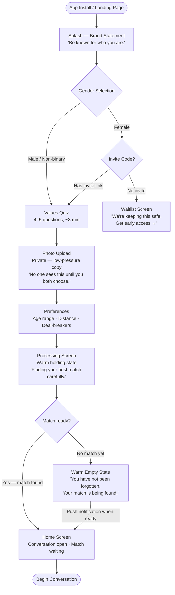
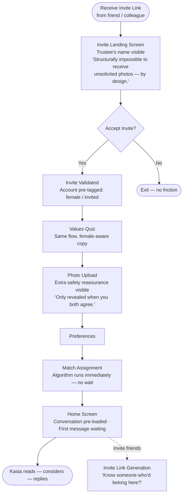
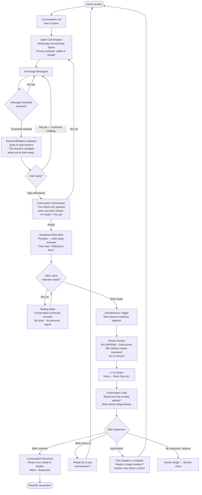
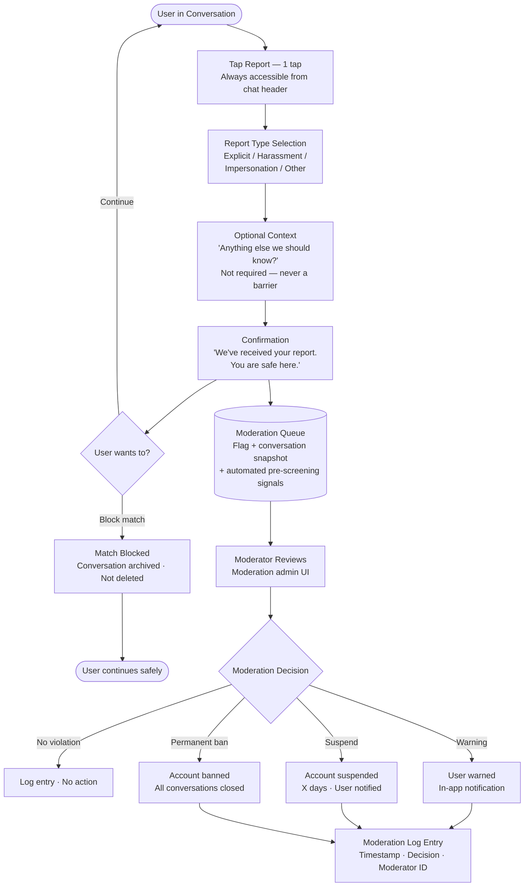

# UX Design Specification Blinder

**Author:** Piotr.palej
**Date:** 2026-03-11

---

<!-- UX design content will be appended sequentially through collaborative workflow steps -->

## Executive Summary

### Project Vision

Blinder is a slow dating platform built on a structural conviction: genuine human connection begins with personality, not appearance. The product removes the visual layer from matching and early interaction entirely. Users are matched by values and personality via a short onboarding quiz, enter a real-time chat environment with a curated match, and unlock a consensual mutual photo reveal only after both parties independently opt in — with a minimum message threshold required first.

The UX is designed as an antidote to the swipe-and-browse model. There is no profile gallery, no swiping, no browsing. The only currency is personality. Every design decision serves one mandate: make the dropout cohort — people who believe they have no chance in the current system — feel that they belong here.

**Platform:** React Native mobile app (iOS + Android), mobile-first, Poland-first launch.  
**Brand North Star:** At least one person who uses Blinder believes they are no longer lonely.

### Target Users

**Marek — The Invisible Man (Primary)**  
28, Kraków. Real depth, not conventionally attractive by Tinder's standards. Self-excluded after photo-first apps rejected him before he could speak. Needs a playing field where personality is the entry ticket. His success moment: a conversation that goes deep before anyone has seen his face.

**Kasia — The Burned-Out Woman (Primary)**  
26, Warsaw. Left Tinder due to volume fatigue and objectification. Does not want better filtering — she wants structural relief. Her success moment: realising the conversation she is in feels like meeting someone at a dinner party, not being selected from a catalogue.

**Natalia — The Woman Who Never Tried (Discovery)**  
23, Gdańsk. Ambient self-exclusion — never downloaded a dating app because she assumed apps are for people who look a certain way. Needs a marketing and onboarding experience that speaks directly to her. Her success moment: getting through onboarding without being asked to compete visually.

**Internal Moderator (Operator)**  
Trust and safety team member (1–2 people at MVP). Reviews flagged content, applies moderation actions, views automated pre-screening signals. Needs a minimal but functional admin interface.

### Key Design Challenges

1. **Designing for radical unfamiliarity.** The no-browse, no-swipe model is a fundamental departure from every existing dating app. Users arrive with deeply ingrained mental models (swipe right/left, browse profiles). The UX must communicate what Blinder is — and crucially, what it is not — without lengthy explanation. Every screen must feel intentional, not broken.

2. **The reveal as a high-stakes emotional moment.** The mutual photo reveal is the product's signature interaction. It is a moment of vulnerability for both users. The UX must carry emotional weight proportional to that significance — simultaneous exchange, appropriate friction, and a design that honours the courage it took to get there. It cannot feel like clicking a button.

3. **Waiting without anxiety.** The product is slow by design — and waiting (for a match, for a reply, for the other person to opt into a reveal) is structurally built in. Empty states and waiting states must feel like reassurance, not rejection. Users from the dropout cohort are sensitive to signals that read as "nobody chose you."

4. **Onboarding that converts Natalia.** The woman who never tried needs the onboarding experience to validate her decision to sign up before she even completes it. The photo upload step — the most anxiety-producing moment — needs exceptional copy and UX treatment to prevent abandonment.

5. **Trust without social proof.** Blinder has no public profiles, no visible reviews, no follower counts. The trust architecture is structural (consent mechanics, safety systems) but users need to *feel* safe without those conventional signals. The UI itself must communicate trustworthiness.

### Design Opportunities

1. **The reveal experience as a brand-defining moment.** No other dating app has this mechanic. Done right, the simultaneous mutual reveal can become the most emotionally memorable interaction in digital dating — a genuine user story moment that drives organic word-of-mouth. This interaction deserves the most UX investment of any single screen.

2. **Onboarding as a trust ritual.** The quiz is not just data collection — it is the first experience where Blinder proves its promise. If users feel *seen* by the quiz (questions that treat them as whole people, not profile fields), they arrive in their first conversation with higher confidence and investment. The quiz is brand delivery.

3. **Chat as a depth-encouraging space.** The chat interface has no photo, no profile visible during conversation. This creates a unique canvas — conversation UI can be designed to encourage depth and reciprocity rather than mimicking every other SMS-style messenger. Subtle cues (message count toward reveal, conversation starters) can scaffold the slow dating experience.

4. **Absence as design language.** Things Blinder does NOT have — no browse grid, no swipe cards, no "likes received" counter, no activity indicators designed to trigger anxiety — are as much of the UX as what it does have. The absence of these elements is intentional design. Every decision not to include a feature communicates brand values.

5. **Safety as a visible trust signal.** The structural consent architecture (mutual reveal only, no unsolicited images possible) is a safety feature that can be surfaced in the UX transparently. Showing users *how* they are protected — not just promising them they are — is a competitive differentiator, especially for female users.

---

## Core User Experience

### Defining Experience

The core loop of Blinder is the conversation — two people building genuine familiarity through message exchange before either has seen the other's face. The chat interaction is the product's primary value delivery mechanism: everything else (onboarding, matching, reveal) exists to get users into a meaningful conversation and sustain it.

The most critical single interaction is the mutual photo reveal. It is the product's defining mechanic, its brand signature, and its primary word-of-mouth driver. It must be treated with the emotional weight it deserves: not a button to click, but a moment to experience. Simultaneous, careful, unhurried.

The core loop is:  
**Match → First message → Conversation deepens → Reveal readiness builds → Mutual opt-in → Simultaneous reveal → Continued connection**

Every screen is in service of advancing users through this loop with as little friction and as much emotional safety as possible.

### Platform Strategy

**Primary platform:** React Native mobile app (iOS + Android), launched simultaneously.  
**Interaction paradigm:** Touch-first. No hover states. No keyboard-dependent flows in core journeys.  
**Device capabilities leveraged:**
- Push notifications (match arrival, new message, reveal readiness of other party)
- Camera / photo library access (private onboarding photo upload only)
- Local notification scheduling (conversation re-engagement nudges)

**Web app:** Deferred to Phase 2. Mobile is the only channel at MVP.

**Offline consideration:** Graceful degradation for poor connectivity — message send queue with optimistic UI, retry on reconnect. Real-time chat (SignalR/WebSocket) with fallback to polling if needed.

### Effortless Interactions

The following interactions must require zero conscious effort — they should be instinctive, instant, and invisible as mechanics:

1. **Sending a message.** The chat input must feel identical to any native messaging app the user already uses. No learning curve. No interface novelty. The *conversation* is the novel experience — the *interface* must disappear.

2. **Onboarding completion.** Time from app install to first conversation open: target under 4 minutes. The quiz should feel engaging, not like a form. Photo upload should feel like a private act, not a public performance. The onboarding ends with a match already waiting — not an empty home screen.

3. **Reveal triggering.** When a user is ready to share their photo, the action should be one deliberate tap — no multi-step flow, but enough friction to confirm intentionality. The waiting state (other person not yet ready) must feel patient and safe, not like being rejected.

4. **Reporting.** One-tap in-app reporting with zero friction — the moment a user decides they need to report something, the product must not add barriers. Safety actions are always the highest-priority interaction path.

### Critical Success Moments

These are the make-or-break moments in the Blinder user journey. If any of these interactions fails, the product fails — regardless of how polished everything else is.

**Moment 1 — End of Onboarding: "There is already someone waiting for you."**  
The screen a new user sees immediately after completing the quiz must not be an empty state or a "we're finding your match" loading message. The product must be ready to present a match — or a holding message that feels warm and anticipatory, not like rejection. This moment sets the emotional tone for everything that follows.

**Moment 2 — The First Real Reply**  
When the other person sends a message that shows they have actually read and responded to what was said — not a generic opener — the user experiences proof that the matching worked. The notification design and chat entry experience must make this moment feel significant, not routine.

**Moment 3 — The Mutual Reveal**  
Both users have independently indicated readiness. Both photos arrive simultaneously. This is the most emotionally loaded moment in the product. The UX must:
- Make the waiting state feel suspenseful and warm, not anxious
- Deliver the reveal with appropriate ceremony — not a quick screen flash
- Give both users a moment to absorb what they see before the next action
- Make it easy to continue the conversation immediately after

**Moment 4 — Returning After a Reveal**  
A user who experienced a reveal — comfortable or awkward — and returns to Blinder within 7 days is demonstrating emotional safety. The product must gently acknowledge their return without forcing a response. If the match did not continue, the next-match flow must feel like a fresh start, not a reminder of what didn't work.

**Moment 5 — The Empty State (Match Not Yet Available)**  
For Marek and Natalia, a waiting screen is high-risk. This state must actively communicate: *"You have not been forgotten. Your match is being found carefully."* Never use neutral or generic empty state patterns here. The copy and visual design of the "no match yet" state is brand-critical.

### Experience Principles

These principles govern every UX decision in Blinder. When two designs are in tension, these principles serve as the tiebreaker.

**1. Personality is the UI.**  
The interface exists to carry conversation, not to perform features. Every element that is not in direct service of the conversation should be removed or made invisible. Blinder's UX should feel quiet, uncluttered, and calm — a contrast to the visual noise of every competitor.

**2. Waiting is not failure.**  
The product is slow by design. Waiting for a match, for a reply, for a mutual reveal must never feel like rejection. Empty states and loading states must be designed with the same care as primary interactions. Reassurance is a first-class UX deliverable.

**3. The reveal deserves ceremony.**  
The mutual photo reveal is the product's signature moment. It must never feel incidental, accidental, or routine. Every design choice leading to and through the reveal — the build-up, the trigger, the simultaneous delivery, the aftermath — must acknowledge that something significant just happened.

**4. Safety is never hidden.**  
Trust mechanics (mutual consent architecture, content moderation, reporting) must be surfaced clearly without being intrusive. Users — especially women onboarding for the first time — must be able to see *how* they are protected, not just be promised that they are.

**5. The dropout cohort belongs here.**  
Every screen, every piece of microcopy, every empty state is an opportunity to reinforce that this product was built for people who were told the current system isn't for them. Design decisions that might feel standard in another app (e.g., showing match count, showing activity status) must be evaluated for whether they could make Marek, Kasia, or Natalia feel that the old judgment system has crept back in.

---

## Desired Emotional Response

### Primary Emotional Goals

**The primary emotional goal of Blinder is to make users feel seen as a whole person — before they are seen at all.**

More than any individual feature or interaction, Blinder's UX must consistently communicate: *you belong here. Your personality is enough. Being yourself is the right strategy.*

The product converts courage into connection. Every design decision must ask: does this lower the cost of being genuine, or raise it?

**By persona:**

- **Marek** should feel: *The game is finally fair. I am being judged on something I actually have.*
- **Kasia** should feel: *I am being spoken to, not browsed. This conversation started because we're compatible — not because someone liked my photo.*
- **Natalia** should feel: *I was right to come here. This place was built for me, not for people who look a certain way.*

### Emotional Journey Mapping

| Stage | Target Emotion | Emotional Risk to Avoid |
|---|---|---|
| **Discovery / Marketing** | Curiosity + recognition ("this is for people like me") | Scepticism ("another app making promises") |
| **Onboarding start** | Calm confidence | Anxiety ("what will they see?") |
| **Photo upload moment** | Private safety | Exposure dread |
| **Post-quiz / match arrival** | Anticipation + warmth | Emptiness / rejection ("nobody wants to match with me yet") |
| **First message exchange** | Curiosity + genuine interest | Performance anxiety ("what do I say?") |
| **Deep conversation building** | Investment + belonging | Vulnerability fatigue |
| **Reveal readiness moment** | Nervous excitement (positive valence) | Dread / regret |
| **Mutual reveal** | Wonder + relief + connection | Deflation / awkwardness amplified by poor UX |
| **Post-reveal continuation** | Warmth + safety proven | Pressure to perform or react correctly |
| **Post-reveal, match didn't continue** | Resilience + dignity | Shame / embarrassment |
| **Return visit (any)** | "I want to be here" | Obligation / FOMO |

**The emotional arc to design for:**  
Cautious hope → Growing trust → Genuine investment → Courageous vulnerability → Reward proportional to courage

### Micro-Emotions

These fine-grained emotional states are the texture of the Blinder experience. Each one has a design implication.

**Emotions to cultivate:**
- **Belonging** — "This platform was made for someone like me"
- **Quiet confidence** — "I have something worth offering here"
- **Anticipation** — "I wonder what they are like"
- **Surprise (positive)** — "I didn't expect this conversation to go this deep"
- **Earned pride** — "I was brave enough to reveal, and I am glad I did"
- **Safety** — "Nothing here can be done to me without my consent"

**Emotions to actively prevent:**
- **Inadequacy** — triggered by any mechanic that ranks, scores, or counts in a visible way (e.g., match count visible to others, "popularity" signals)
- **Ghosting dread** — long silences after initiation feel like rejection; design must provide reassurance, not silence
- **Exposure anxiety** — the photo upload and reveal mechanics must structurally and visually reinforce that photos are private until *both* parties choose
- **Volume anxiety** — for women, any hint of an inbox filling up with low-effort reach-outs would recreate the exact Tinder dynamic they escaped
- **Performance pressure** — the quiz and first conversation must never feel like a test with right and wrong answers

### Design Implications

**Belonging → Brand voice and microcopy**  
Every piece of copy — from onboarding prompts to empty state messages to error states — must speak directly to the dropout cohort. Microcopy is not UI furniture; it is brand delivery. The voice should feel like a trusted friend who already believes in you, not a neutral system message.

**Quiet confidence → Absence of ranking signals**  
Remove or never build: visible match counts, "X people want to meet you" notifications, popularity indicators, response rate percentages. These signals exist to drive dopamine loops; they will make Marek feel the old judgment is back. The only feedback signal that matters is the quality of the conversation happening right now.

**Anticipation → Reveal build-up design**  
The reveal is not a single moment — it is a 3-act arc: *readiness build-up* (message count progress, gentle cue that both have been in this together), *waiting state* (one party ready, other not yet — must feel like mutual patience, not rejection), *simultaneous delivery* (ceremony, not click). Design the arc, not just the button.

**Safety → Structural transparency**  
Surface "how you're protected" in onboarding and at key trust moments (first conversation opening, reveal mechanism explanation). Do not bury it in T&Cs. Show the mechanic: *"Your photo only appears when you both choose. Neither of you can force this."* Visible consent architecture is a UX feature, not just a legal posture.

**Preventing ghosting dread → Active waiting states**  
When a user has sent a message and is waiting for a reply, the UI must be active — not a silent void. Indicators that the match is real and reachable (without anxiety-inducing read receipts) must be designed deliberately. Consider: last active status that is warm ("active recently"), or simple reassurance copy in the waiting state.

**Preventing performance pressure → Question framing in quiz and chat**  
The onboarding quiz questions should feel like genuine curiosity about who someone is — not a personality screening test with scoreable answers. The first conversation prompt (if the product generates one) should be an open door, not a task to complete.

### Emotional Design Principles

**1. Courage should feel rewarded, not risky.**  
Every act of vulnerability Blinder asks of users — uploading a private photo, opening up in conversation, opting into the reveal — must be immediately followed by a design signal that says: *you made the right choice.* The product's job is to make the gap between "brave moment" and "reward" as short as possible, and the gap between "brave moment" and "negative outcome" as emotionally safe as possible.

**2. Absence of judgment is itself the product.**  
Blinder's most powerful emotional offering is what it removes: the constant low-level awareness of being rated. The absence of swiping, browsing, match counts, and read receipts is not just a feature list difference — it is an emotional environment difference. Design to maintain this absence as the product scales. Every new feature must be evaluated: does this bring judgment back in?

**3. The reveal is the emotional climax — design it that way.**  
All emotional investment built across the conversation arc must be honoured at the reveal. The interaction cannot be anticlimactic, rushed, or buried. If the reveal feels casual, the whole preceding investment feels cheapened. The design must make the reveal feel like it matters — because for these users, it genuinely does.

**4. Dignity in every outcome.**  
Not every reveal leads to continued connection. Not every match produces a relationship. The product must handle rejection and discontinuation with the same care as success. "No match available yet," "the conversation has ended," "your reveal wasn't mutual" — these states must preserve the user's dignity and sense of worth. They are not system failures; they are human experiences the product must treat with respect.

---

## UX Pattern Analysis & Inspiration

### Inspiring Products Analysis

#### Calm Wayfinding — Principle (inspired by Zurich Airport)

**The principle:**  
Calm wayfinding designs for users navigating an unfamiliar environment with an important destination. It achieves trust through extreme clarity of hierarchy, visual calm, and confident prioritisation of the next meaningful action — never wasting cognitive load on decorative elements when there is a journey to complete.

Critically for Blinder: airports serve users who know their destination (a gate). Blinder serves users who are looking for something harder to name — a soulmate. The calm is the same. The vocabulary is different.

**Applied as emotional waypoints:**  
Blinder replaces departure boards with emotional waypoints — language and visual tone that tells users where they are on their journey toward connection:

- Before a match: *"Your match is being found. The best connections take a moment."*
- In early conversation: *"You're getting to know each other."*
- When reveal unlocks: *"Something real might be here."*
- After a reveal, choosing to continue: *"Would you like to keep talking?"*
- After a reveal, choosing a new path: *"Ready for a new conversation?"*

Every screen communicates: *we know where you are and what you need next.*

**Transferable to Blinder:**  
Calm, typography-led visual hierarchy across all non-chat screens. The home screen, match arrival, waiting states, reveal arc, and post-reveal transition all share the same confident, uncluttered visual language. No noise. Every element earns its place.

---

#### WhatsApp — Interface Invisibility

**What it does well:**  
WhatsApp has achieved something rare: a chat interface so well understood it is effectively invisible. Users do not think about how to use it — they think about what to say. This invisibility is the product's greatest UX achievement.

**Key UX observations:**
- Conversation list: clean, name-first, last message preview, unread count. No noise.
- Chat view: generous message bubbles, clear sent/received differentiation, timestamp discretion (small, not prominent)
- Input area: always accessible — text field, send, attach. Nothing more.
- No engagement mechanics in the messaging layer: no likes, no reactions (original), no social proof. The message is the unit of value.

**Transferable to Blinder:**  
Blinder's chat interface is modelled after WhatsApp conventions, not dating app chat. Users know how to use WhatsApp. The moment Blinder's chat feels like WhatsApp, the interface disappears and the conversation can do its work. Marek, Kasia, and Natalia all already know this interface. There is nothing to learn. Just talk.

---

#### Signal — Structural Trust Made Visible

**What it does well:**  
Signal makes its privacy architecture visible before a user can send their first message. "Your messages are end-to-end encrypted. Always." Not buried in settings. Surfaced at the moment of entering a conversation — stated as fact, not promise.

**Why Blinder needs this more than WhatsApp does:**  
WhatsApp's trust is inherited from pre-existing relationships. When Marek messages a friend, he already trusts them. When Marek enters a Blinder conversation with a stranger, no such trust exists. Signal's pattern of explicit structural trust statements at conversation entry solves exactly this problem.

**Transferable to Blinder:**
- A persistent, subtle "private and protected" indicator in the chat header — not a banner, not a modal. A small discrete mark that says: *this conversation is between you and them. By design.*
- Photo privacy stated explicitly at upload: *"Your photo is stored privately and only appears when you both choose."*
- Structural consent architecture surfaced at the reveal trigger: *"Neither of you can do this alone. You both have to choose."*

Visible consent architecture is a UX feature, not a legal posture.

---

### The Reward Architecture: Macro-Hits at Meaningful Milestones

Blinder does not remove dopamine from the dating experience. It restructures when and why it arrives.

**Tinder's model:** micro-hits constantly — every swipe, every match notification, every "someone liked you." Short, random intervals. Addictive. Hollow. Optimised for return visits, not connection.

**Blinder's model:** macro-hits at earned milestones:

1. **Match arrival** — earned by completing a genuine quiz and being selected by an algorithm that considered who you actually are. Not a random swipe. This hit is larger than a Tinder match because it carries meaning.

2. **The mutual reveal** — earned by investing in a real conversation over time. The dopamine hit from a Blinder reveal is categorically larger than any Tinder interaction precisely because it was worked for. Two people chose to be seen — together.

3. **The mutual "continue" confirmation** — after the reveal, both people independently asked: *"Would you like to keep talking?"* Both said yes. This is the product's north star made tangible. Two people actively choosing each other after knowing who the other person is. Every other metric is a proxy for this moment.

**Design implication:** the product must deliver these milestone moments with appropriate ceremony. A match notification that feels like an alarm is wrong. A reveal that feels like clicking a button is wrong. The reward must feel proportional to what was earned.

---

### Post-Reveal Flow: The Journey Continues

The reveal is not the destination — it is the moment the journey becomes real.

After a mutual reveal, both users are independently asked: *"Would you like to keep talking?"* This is the product's second mutual consent gate, structurally identical to the reveal itself: neither party knows the other's answer until both have responded.

| Outcome | UX Treatment |
|---|---|
| **Both continue** | Conversation resumes — warm, expansive. The app steps back. They will likely move to real life. That is success. Blinder's job is done. |
| **Both move on** | *"Ready for a new conversation?"* — fresh chapter framing, not rejection. A new match journey begins. |
| **Asymmetric** (one continues, one moves on) | Result not shown to either party. Neutral framing: *"This chapter is complete. Ready to begin another?"* The person who wanted to continue is protected from knowing. Dignity preserved. |
| **No response** | Graceful timeout with a single gentle nudge, then neutral close. |

Post-reveal is the city after landing. It should feel expansive — like something is beginning, not ending.

---

### Anti-Patterns to Avoid

These patterns are drawn from major dating apps and represent the UX decisions that created the dropout cohort Blinder is built for.

**1. The Browse Grid**  
A scrollable gallery of profile photos invites snap judgment before conversation can begin. This layout trains the eye to sort, rank, and dismiss. It is the architecture of objectification. Never used in Blinder.

**2. The Swipe Mechanic**  
Binary judgment on a person is a dopamine loop, not a connection tool. Nothing in Blinder should have a gesture or micro-interaction that echoes the swipe. Its absence is a moral position.

**3. Engagement Metrics as Status Signals**  
"47 new likes." "You appeared in 312 searches." These exist to create value from numbers — and devastation when the numbers are low. None of these signals exist in Blinder. The only feedback signal that matters is the quality of the conversation happening right now.

**4. Inbox-as-Flood**  
When an inbox fills with low-effort reach-outs, the product becomes a harassment experience. Blinder's 3-conversation structural limit eliminates this. The UI must never surface volume as a feature or status signal.

**5. Premium Urgency Gating**  
"Your profile was liked — upgrade to see who." Blinder's premium model never gates access to something the user expected to receive. Upgrade prompts feel like capability expansion, not hostage-taking.

**6. Precise Activity Status**  
"Last seen 2 minutes ago" transforms anticipation into dread. Status indicators in Blinder must be warm and vague ("active recently") — never precise enough to enable passive surveillance of whether someone has "ignored" you.

**7. Micro-Reward Mechanics**  
Any feature that delivers small, frequent validation hits (daily streaks, reaction counts, visitor logs) recreates the dopamine architecture Blinder is designed to replace. The reward schedule is milestones, not micro-hits.

---

### Transferable UX Patterns

| Pattern | Source | Apply to Blinder | Why it works for the dropout cohort |
|---|---|---|---|
| Emotional waypoints | Calm wayfinding principle | All screens — tell users where they are on their journey | Marek and Natalia need reassurance they haven't been forgotten; clear milestones replace the anxious void |
| Typography-led visual hierarchy | Calm wayfinding principle | Home, match arrival, waiting states, reveal arc | Reduces cognitive load for users who are already emotionally tense |
| Invisible chat interface | WhatsApp | Chat view — no reinvention of conventions | Zero learning curve; users focus on the conversation, not the tool |
| Conversation-as-unit-of-value | WhatsApp | No reactions, no likes, no engagement mechanics in chat | Removes the performance layer; personality is the only currency |
| Discreet, non-anxious status signals | WhatsApp | "Active recently" — never precise timestamps | Removes dread; availability without surveillance |
| Explicit structural trust at conversation entry | Signal | Chat header indicator + reveal consent statement | Kasia and Natalia need to see *how* they're protected, not just be promised they are |
| Macro-reward at meaningful milestone | Blinder-native | Match arrival ceremony + reveal ceremony + continue confirmation | Earned reward is proportionally larger; sustainable motivation, not addiction |
| Mutual consent gate (second use) | Blinder-native | Post-reveal "continue?" flow | Extends the consent architecture beyond the reveal; every step is chosen, never imposed |

---

### Design Inspiration Strategy

**Adopt directly:**
- WhatsApp's chat interface conventions — bubble layout, input area, conversation list structure. Users know this. Make Blinder's chat feel like home.
- Signal's explicit structural trust statement at conversation entry. Surfaced as a subtle persistent indicator, not a modal. Present from the first message.

**Adapt thoughtfully:**
- WhatsApp's status indicators → replace precision with warmth. "Active recently" only. No read receipts unless both users opt in.
- Calm wayfinding's departure board → translate to emotional waypoints. Users always know where they are on their journey toward connection — through language and tone, not progress bars.
- Signal's onboarding trust moment → extend to photo upload screen and reveal trigger. State the structural consent architecture at every moment it matters.

**Avoid entirely:**
- Any browse grid, swipe mechanic, or photo-first interaction from dating apps
- Engagement metrics, match count visibility, or popularity signals
- Inbox volume as a feature or status signal
- Urgency-based premium conversion mechanics
- Precise activity status enabling passive surveillance
- Any micro-reward mechanic that recreates the Tinder dopamine loop

---

## Design System Foundation

### Design System Choice

**Selected approach: Themeable System with Design Token Layer**  
**Primary library: NativeWind (Tailwind CSS for React Native) or Tamagui**

Blinder uses a themeable component system built on a comprehensive design token layer. The component primitives are battle-tested and well-documented; the brand expression — colour, typography, spacing, shape, motion — is fully owned through tokens. The interface feels distinctly Blinder, not like a generic app, but the team does not pay the cost of rebuilding every primitive from scratch.

### Rationale for Selection

**Why not custom (Option A):**  
A fully custom design system is the correct long-term destination for a product with Blinder's brand conviction. At MVP with a lean founding team, it is the wrong starting point. The cost of building and maintaining custom primitives (input fields, modals, notifications, navigation) delays shipping and introduces unnecessary risk.

**Why not established-only (Option B):**  
Material Design and NativeBase provide fast defaults, but their visual language is recognisable as generic. Blinder must feel unlike any dating app and unlike any standard utility app. Themed Material components with insufficient token override still read as Material. The emotional tone Blinder requires — calm, intimate, trustworthy — cannot be achieved through minor colour swaps on a standard system.

**Why themeable (Option C):**  
NativeWind or Tamagui provide structural component primitives (layout, typography scale, spacing system, interactive states) that are customised entirely through a design token layer. The brand owns its visual expression. The team ships on proven foundations. This is the right balance for an MVP that needs to look and feel like nothing else while moving quickly.

### Design Tokens

The token layer is Blinder's visual identity made systematic. All design decisions are expressed here — not in one-off styles.

#### Colour Palette

| Token | Role | Direction |
|---|---|---|
| `color.background.primary` | App background | Deep off-white or near-black — not pure white or pure black. Warm, not clinical. |
| `color.background.surface` | Cards, chat bubbles, modals | Slightly elevated from background — subtle warmth |
| `color.accent.primary` | CTAs, active states, reveal trigger | One deliberate accent — rich, non-aggressive. Not Tinder red. Consider deep amber, forest green, or indigo. |
| `color.accent.secondary` | Secondary actions, tags | Muted version of primary accent |
| `color.text.primary` | Body text, names | High contrast against background — legibility first |
| `color.text.secondary` | Timestamps, labels, captions | Reduced emphasis — present but not competing |
| `color.text.muted` | Placeholder text, disabled states | Clearly subordinate |
| `color.safety` | Trust indicators, consent statements | Distinct from accent — calm blue or teal. Communicates safety, not urgency. |
| `color.danger` | Report button, destructive actions | Accessible red — reserved exclusively for safety actions |

**Colour philosophy:** The palette should feel like a well-lit room at dusk — warm, calm, intimate. Not bright. Not cold. Not corporate. The accent colour is used sparingly — its job is to mark the moments that matter (the reveal button, the continue prompt), not to decorate every screen.

#### Typography

| Token | Role | Direction |
|---|---|---|
| `type.family.primary` | All UI text | Single typeface — high legibility, warm character. Consider: Inter, DM Sans, or a humanist sans-serif. Not geometric, not slab. |
| `type.size.display` | Large moments — reveal screen, onboarding headlines | Generous. Typography carries the emotional weight where there is no photography. |
| `type.size.body` | Conversation text, descriptions | Optimised for sustained reading — not too small, generous line height |
| `type.size.caption` | Timestamps, labels, secondary info | Small but legible — never illegible on any supported device size |
| `type.weight.regular` | Body text | Default weight for conversation and descriptions |
| `type.weight.medium` | Names, labels, navigation items | Moderate emphasis without heaviness |
| `type.weight.bold` | Headlines, reveal moments, key prompts | Reserved for genuine emphasis |
| `type.lineHeight.body` | Body reading | 1.5–1.6 — generous for emotional readability |

**Typography philosophy:** Typography is the primary visual element in Blinder. There are no profile photos in the chat, no browse grid, no imagery in most screens. The typeface and its sizing carry the brand's emotional register. It must be legible, warm, and confident.

#### Spacing & Shape

| Token | Role | Direction |
|---|---|---|
| `space.base` | Base unit (4px or 8px) | All spacing derived from this unit — consistency throughout |
| `radius.card` | Match card, surface cards | Moderately rounded — friendly, not childish |
| `radius.bubble` | Chat message bubbles | WhatsApp-conventional — users already know this shape |
| `radius.button` | CTA buttons | Rounded but not pill — deliberate, not playful |
| `radius.input` | Text input fields | Consistent with button radius |

#### Motion

| Token | Role | Direction |
|---|---|---|
| `motion.duration.fast` | Micro-interactions (button press, input focus) | 150–200ms |
| `motion.duration.standard` | Screen transitions, modal entry | 250–300ms |
| `motion.duration.reveal` | The mutual reveal moment | 600–800ms — longer, more ceremonial |
| `motion.easing.standard` | Default easing | Ease-in-out — calm, not mechanical |
| `motion.easing.reveal` | Reveal delivery | Custom ease — slow start, confident arrival |

**Motion philosophy:** Animation in Blinder is for emotional pacing, not decoration. The reveal animation is the only interaction that gets a bespoke motion treatment. Everything else uses standard, calm transitions that do not draw attention to themselves.

### Implementation Approach

**Phase 1 — Token system setup (before first screen)**  
Define all design tokens in a central config before any UI is built. Every colour, type size, spacing value, and radius lives in the token file. No hardcoded values anywhere in the codebase.

**Phase 2 — Core component library (built alongside MVP screens)**  
Build the minimum component set needed for MVP screens:
- `Typography` (display, body, caption variants)
- `Button` (primary, secondary, ghost, danger)
- `Input` (text field, multiline)
- `Card` (match card, surface card)
- `ChatBubble` (sent, received)
- `ChatInput` (input bar with send action)
- `StatusIndicator` (active recently badge)
- `RevealProgress` (message count indicator — subtle)
- `ConsentIndicator` (chat header privacy mark)
- `EmptyState` (match waiting, no conversations)
- `Modal` (reveal confirmation, continue confirmation)

**Phase 3 — Scale and refine post-MVP**  
After validation, invest in component documentation, design system site, and additional components for growth features.

### Customisation Strategy

**What NativeWind / Tamagui configures globally:**
- Colour palette via CSS custom properties or theme config
- Typography scale and font family
- Spacing scale
- Border radius values
- Dark/light mode switching (single token set serves both)

**What requires custom component work:**
- `ChatBubble` — WhatsApp-conventional but skinned to Blinder tokens
- `RevealProgress` — unique to Blinder; no off-the-shelf equivalent
- `ConsentIndicator` — Signal-inspired header badge; custom
- `RevealModal` — ceremonial layout with motion treatment; custom
- `ContinuePrompt` — post-reveal mutual consent gate; custom
- `EmptyState` variants — brand-voice copy embedded in component

**Dark mode:**  
Supported from day one via token layer. Dating apps are used predominantly at night. Dark mode is not optional for Blinder's use case and user context.

---

## Core Interaction Design

### Defining Experience

**Blinder's defining experience:** *"Be known. Then be seen."*

If users describe Blinder to a friend, they describe the reveal: *"You chat first, and then you both decide together when to share your photos — at the same time. Neither of you knows what the other looks like until you both say yes."* That is the moment that makes this product a story worth telling.

The defining interaction is not a single screen — it is an arc:

1. A match arrives that was chosen by an algorithm, not a swipe
2. A conversation begins, carried entirely by personality and curiosity
3. Over time, readiness builds — a quiet awareness that something real is forming
4. One person indicates they are ready. The product waits, privately.
5. The other person indicates they are ready. Neither knows the other has.
6. Both photos appear simultaneously. The arc completes.

Every other screen in the product exists to carry users safely through this arc.

### User Mental Model

**What users bring from previous experience:**

- **Tinder/Hinge mental model:** browse → swipe → match → (maybe) talk.  
  Photo first, conversation optional. Users trained to judge and be judged visually before any words are exchanged.

- **WhatsApp mental model:** open a conversation, type, send. Input/response rhythm is deeply ingrained. No learning curve for the messaging layer.

- **No mental model for the reveal:** this interaction has no precedent in any consumer app. Users will arrive without expectations — which is both an opportunity (no bad habits to unlearn) and a risk (no familiar scaffolding).

**Where users are likely to get confused:**

- *"When does the reveal become available?"* — the message threshold must be communicated without making it feel like a countdown timer or a game mechanic.
- *"Did they say yes yet?"* — the waiting state after indicating readiness is emotionally charged. Users need reassurance without being tormented by a progress indicator.
- *"What happens after?"* — users have no script for what comes after a reveal. The "continue?" prompt gives them a clear next action.

**What Blinder must teach, and how:**

| Unknown | Education Method |
|---|---|
| No browsing / no swiping | Onboarding screens + empty state copy |
| Reveal requires message threshold | Subtle in-chat progress indicator + contextual tooltip |
| Reveal is mutual and simultaneous | Explained at reveal trigger moment, not in T&Cs |
| Post-reveal "continue?" gate | The prompt itself is self-explanatory — no pre-education needed |

### Success Criteria for Core Interaction

The reveal interaction succeeds when:

- **Both users arrive at it.** A reveal that never happens is a failed product promise, not a user choice. If the message threshold is too high, or the reveal trigger is too buried, users will drift away before they ever reach it.
- **Both users feel ready, not pressured.** The design must never make one party feel they are falling behind or holding things up. Readiness is private until mutual.
- **The reveal feels proportional to what preceded it.** If a 3-week conversation culminates in a screen that feels like clicking a settings toggle, something has failed. The design must match the emotional weight of the moment.
- **The aftermath is handled with care.** Success is not just the photos appearing. Success is both users still in the app five minutes later — continuing the conversation or ready for a new one, with their dignity intact either way.

**Speed:** The reveal itself (from "both ready" to "photos visible") should take 600–800ms. Long enough to feel momentous. Short enough not to feel like buffering.

**Feedback signals for the user:**
- Reveal readiness: a gentle, non-intrusive indicator in the chat that the option is now available — not a push notification, not a badge. A quiet affordance in the conversation itself.
- Waiting state: warm, reassuring. *"You've indicated you're ready. Waiting for them."* Not a spinner. Not a countdown.
- Reveal delivery: full-screen moment. Names. Photos. Silence before the next prompt.
- Post-reveal: *"Would you like to keep talking?"* — both asked independently.

### Novel vs. Established Patterns

**The chat layer: entirely established.**  
WhatsApp conventions apply wholesale. No education required. No novel interaction. The conversation interface must feel completely familiar so users never think about how to use it.

**The reveal: entirely novel.**  
No existing consumer app has this mechanic. Users have no mental model for it. This is a design opportunity, not a liability — there are no bad expectations to overcome.

*How we teach the novel pattern:*
- **Metaphor:** *"Like finding out together."* The product copy frames the reveal as a shared discovery, not a transaction. Both people are on the same side.
- **Progressive disclosure:** users learn the reveal exists during onboarding (briefly, without pressure), encounter a subtle reminder when the threshold approaches, and receive a clear explanation at the moment they first see the trigger. No front-loading of complexity.
- **The mechanic is self-explaining at the moment of use:** when a user taps "I'm ready to share my photo," the screen tells them exactly what happens next and confirms that both must agree. There is no ambiguity at the point of action.

**The matching: novel absence.**  
No swipe, no browse, no action required from the user to receive a match. This is unusual enough to require onboarding explanation, but simple enough that one screen covers it: *"We'll find your best match. You'll get a conversation when we do."*

**Post-reveal continuation gate: partly novel.**  
The "continue?" mutual consent prompt borrows from familiar confirmation dialogs but applies them to an emotionally loaded context. The interaction pattern is familiar; the emotional context is new. The design must honour the context without overcomplicating the mechanic.

### Experience Mechanics: The Reveal Arc in Detail

#### Phase 1 — Readiness Build-Up (In-Conversation)

**Trigger:** Message count reaches the minimum threshold (exact number TBD in product decision — PRD notes this as a UX phase decision).

**What happens:**
- A subtle, non-intrusive reveal affordance appears within the conversation — not a push notification, not a modal interruption. A quiet element below or above the input area.
- Copy: *"You've had a real conversation. The reveal is available when you're both ready."*
- No urgency. No countdown. The affordance remains available indefinitely.
- The other party sees the same affordance independently — neither knows if the other has noticed it.

**Design requirement:** the reveal affordance must feel like a door that has quietly opened — not an alarm that has gone off.

---

#### Phase 2 — Readiness Indication (Solo Action)

**Trigger:** User taps the reveal affordance.

**What happens:**
- A focused confirmation screen appears. Not a modal — a full transition.
- Explanation surfaced here (not before): *"Your photo will only appear when you both choose. This can't happen unless you're both ready."*
- Single action: *"I'm ready to share my photo"*
- Secondary: *"Not yet"* — always available, always consequence-free.

**On confirmation:**
- User's readiness state is recorded privately.
- They return to the conversation. The affordance changes state subtly: *"You've indicated you're ready. Waiting for them."*
- No timing pressure. No indication to the other party.

**Design requirement:** the "not yet" option must be visually equal to the "ready" option — no dark patterns that nudge toward readiness before the user genuinely feels it.

---

#### Phase 3 — Waiting State

**Trigger:** One party has indicated readiness; the other has not yet.

**What happens:**
- The waiting user sees: *"You've indicated you're ready. Waiting for them."*
- The conversation continues normally — nothing is paused or suspended.
- No timer. No read receipt equivalent. No way to see if the other person has seen the affordance.
- If the other person never indicates readiness, the conversation continues indefinitely with no consequence.

**Design requirement:** the waiting state must never feel like being stood up. It must feel like shared patience — two people on the eve of something, neither rushing the other.

---

#### Phase 4 — Mutual Trigger & Reveal Delivery

**Trigger:** Second party indicates readiness.

**What happens:**
- System detects mutual readiness.
- Both devices receive a simultaneous notification / transition.
- Full-screen reveal moment: names displayed, then photos appear with the 600–800ms motion treatment.
- No immediate prompt. A moment of space — 1–2 seconds — before anything interactive appears.
- Then: *"[Name] — there they are."* (or equivalent brand-voice copy)

**Design requirement:** the reveal screen is the most important screen in the product. It receives the most design investment of any single interaction. It must feel like a moment has occurred — not a screen has loaded.

---

#### Phase 5 — Post-Reveal Continuation Gate

**Trigger:** Reveal has been delivered to both parties.

**What happens:**
- Both users are independently shown: *"Would you like to keep talking?"*
- Each responds privately: Yes / Start a new conversation.
- Neither sees the other's choice until both have responded (or timeout).

**Outcomes:**
- Both yes → conversation resumes with both photos now visible in the chat header. Warm, expansive. App steps back.
- Both move on → *"Ready for a new conversation?"*
- Asymmetric → *"This chapter is complete. Ready to begin another?"*
- No response → gentle timeout, then neutral close.

**Design requirement:** the continuation gate must not feel like a hot-or-not rating. The framing is always about the conversation and the connection — never about the appearance of the other person.

---

## Visual Design Foundation

### Colour System

#### Design Direction: "Well-lit Room at Dusk"

Blinder's palette is warm, intimate, and calm. Not the bright primary colours of productivity apps. Not the aggressive reds and pinks of dating apps. Not the cold greys of enterprise software. The reference point is a well-lit room at dusk — the quality of light that makes people feel comfortable enough to say something true.

The palette must work in dark mode from day one. Dating apps are used at night. Dark mode is the primary context for most Blinder interactions.

**Amber bookend principle:** The amber accent must appear at two emotional peaks — the very beginning (onboarding entry, within the first 3 seconds) and the climax (reveal trigger). This bookend creates a visual through-line users feel subconsciously: gold at the door, gold at the moment.

#### Core Palette

**Dark mode (primary):**

| Role | Token | Hex | Usage |
|---|---|---|---|
| Background primary | `color.background.primary` | `#1A1814` | App background — warm-tinted, not pure black |
| Background surface | `color.background.surface` | `#252219` | Cards, received chat bubbles, modals |
| Background input | `color.background.input` | `#2E2922` | Input fields, secondary surfaces |
| **Background reveal** | **`color.background.reveal`** | **`#0F0D0B`** | **Reveal screen only — darker than primary to make gold accent land; deliberate exception** |
| Accent primary | `color.accent.primary` | `#C8833A` | CTAs, reveal trigger affordance, active states |
| Accent secondary | `color.accent.secondary` | `#8A5A28` | Secondary actions, subtle highlights |
| Reveal accent (gold) | `color.accent.reveal` | `#D4A843` | **Reveal screen only** — more luminous than standard accent; paired exclusively with `color.background.reveal` |
| Text primary | `color.text.primary` | `#F2EDE6` | Body text, names — warm white |
| Text secondary | `color.text.secondary` | `#9E9589` | Timestamps, labels, captions |
| Text muted | `color.text.muted` | `#635D57` | Placeholder text, disabled states |
| Safety indicator | `color.safety` | `#4A9E8A` | Consent statements, privacy indicators — calm, not urgent |
| Danger | `color.danger` | `#D94F4F` | Report button only — reserved, never decorative |

**Light mode (secondary):**

| Role | Token | Hex | Usage |
|---|---|---|---|
| Background primary | `color.background.primary` | `#F8F4EF` | Warm off-white — not pure white |
| Background surface | `color.background.surface` | `#FFFFFF` | Cards, modals — clean elevation |
| Background input | `color.background.input` | `#F0EBE4` | Input fields |
| Background reveal | `color.background.reveal` | `#1A1612` | Reveal screen — dark even in light mode; the reveal moment is intimate |
| Accent primary | `color.accent.primary` | `#B5722A` | Same hue, darkened for contrast on light |
| Text primary | `color.text.primary` | `#1E1A16` | High contrast, warm-tinted |
| Text secondary | `color.text.secondary` | `#6B6159` | Labels, captions |
| Safety indicator | `color.safety` | `#2D7A68` | Darker for light mode contrast |

#### The Reveal Screen: Deliberate Palette Exception

The reveal screen is the **only screen in Blinder that deliberately departs from the standard palette**. It uses:
- `color.background.reveal` (`#0F0D0B`) — deeper than standard background, creating a focused, intimate environment
- `color.accent.reveal` (`#D4A843`) — the luminous gold that marks the product's defining moment
- No other UI chrome — navigation, tabs, and secondary elements are absent on the reveal screen

This exception is intentional brand design, not an inconsistency. Treat it as such in implementation.

#### Colour Philosophy

- **The accent colour is earned.** Deep amber appears at moments of significance: the primary CTA, the reveal trigger, active conversation state. It does not appear on decorative elements.
- **Warmth over neutrality.** Every grey has a warm (brown) undertone. No cool greys. The warmth communicates human presence.
- **Safety is teal, not green.** Green reads as "success" or "go." Teal reads as calm protection — identifiable without feeling like an alert system.
- **Danger is reserved.** `#D94F4F` appears only on the report button and destructive confirmation states. Its scarcity makes its presence unmistakable.

#### Accessibility

All text/background combinations meet WCAG AA minimum (4.5:1 body text, 3:1 large text).

| Foreground | Background | Ratio | Status |
|---|---|---|---|
| Text primary `#F2EDE6` | Background primary `#1A1814` | ~12:1 | ✅ AAA |
| Text secondary `#9E9589` | Background primary `#1A1814` | ~4.8:1 | ✅ AA |
| Accent `#C8833A` | Background primary `#1A1814` | ~4.6:1 | ✅ AA |
| Safety `#4A9E8A` | Background primary `#1A1814` | ~4.5:1 | ✅ AA |
| Reveal gold `#D4A843` | Background reveal `#0F0D0B` | ~9:1 | ✅ AAA |

---

### Typography System

#### Typeface: DM Sans

**Primary typeface: DM Sans** (Google Fonts — free, open source, React Native compatible)  
**Bundle size note:** DM Sans variable font ~85KB — acceptable at MVP. Must not be substituted with `system-ui` during performance optimisation passes without explicit product approval. The typeface is brand delivery, not decoration.

DM Sans is a low-contrast geometric humanist sans-serif with warm, approachable character. Highly legible at small sizes, warm at large display sizes — the right register for a product that takes personality seriously.

**Fallback stack:** `"DM Sans", "SF Pro Text", "Roboto", system-ui, sans-serif`

#### Type Scale

| Token | Size | Weight | Line Height | Usage |
|---|---|---|---|---|
| `display.xl` | 32px | 700 Bold | 1.2 | Reveal screen headline, onboarding hero |
| `display.lg` | 26px | 700 Bold | 1.25 | Section headlines, match arrival |
| `title.md` | 20px | 600 SemiBold | 1.3 | Screen titles, name display |
| `title.sm` | 17px | 600 SemiBold | 1.35 | Card titles, conversation name |
| `body.lg` | 16px | 400 Regular | 1.6 | Chat messages — primary reading size |
| `body.md` | 15px | 400 Regular | 1.55 | Descriptions, quiz answers |
| `body.sm` | 14px | 400 Regular | 1.5 | Supporting text, onboarding body |
| `caption.md` | 12px | 400 Regular | 1.4 | Timestamps, metadata |
| `caption.sm` | 11px | 400 Regular | 1.35 | Very secondary labels |
| `label.md` | 14px | 500 Medium | 1.2 | Button text, navigation labels |
| `label.sm` | 12px | 500 Medium | 1.2 | Tags, small buttons |

**Typography philosophy:** In most Blinder screens there are no photos, no illustrations, no decorative imagery. Typography carries the entire emotional register. The 1.6 line height on chat messages creates breathing room that signals *this conversation matters*. Display sizes are used with intention at the reveal and onboarding moments where emotional weight is highest.

---

### Spacing & Layout Foundation

#### Base Unit: 4px

All spacing derived from a 4px base unit. Practical working unit is 8px.

| Token | Value | Usage |
|---|---|---|
| `space.1` | 4px | Micro spacing — icon gaps, tight label pairs |
| `space.2` | 8px | Default small gap |
| `space.3` | 12px | Icon padding, compact list items |
| `space.4` | 16px | Standard component padding — buttons, cards |
| `space.5` | 20px | Section spacing within cards |
| `space.6` | 24px | Between major UI sections |
| `space.8` | 32px | Screen-level section separation |
| `space.10` | 40px | Generous breathing room — reveal screen, onboarding |
| `space.12` | 48px | Large section breaks |
| `space.16` | 64px | Screen-level top/bottom padding |

#### Onboarding Entry Screen Specification

The first screen Marek sees must feel warm and alive within 3 seconds. Requirements:
- Background: `color.background.primary` (`#1A1814`)
- Top padding: `space.10` (40px) — generous, not cramped
- Headline: `display.xl` (32px, 700) in `color.text.primary` — the brand statement visible immediately
- **Amber accent visible on first screen** — the primary CTA button or a decorative brand element in `color.accent.primary` must appear before the user scrolls or taps. This is non-negotiable: if the first screen is only dark background and white text, the warmth test fails.
- The amber CTA anchor at the bottom of the entry screen closes the visual composition and confirms the product is alive.

#### Layout Approach: Generous and Deliberate

Blinder uses more whitespace than the average mobile app. Visual calm communicates trustworthiness.

**Screen margins:** 20px horizontal padding on all primary screens.  
**Safe area:** Full respect for iOS/Android safe areas.  
**Maximum content width:** Content centres on devices wider than 390px — preserves intimate feel on large phones.

#### Component Shapes

| Token | Value | Usage |
|---|---|---|
| `radius.sm` | 8px | Tags, badges, small buttons |
| `radius.md` | 12px | Input fields, secondary buttons |
| `radius.lg` | 16px | Cards, match card, modals |
| `radius.bubble.sent` | 18px 18px 4px 18px | Sent chat bubble — WhatsApp-conventional |
| `radius.bubble.received` | 18px 18px 18px 4px | Received chat bubble |
| `radius.full` | 9999px | Pill badges, avatar containers |

#### Layout Principles

1. **One primary action per screen.** Every screen has one clear next step. Secondary actions are visually subordinate.
2. **Generous vertical rhythm.** Line heights and section spacing create an unhurried reading rhythm.
3. **Bottom-anchored primary actions.** CTAs live at the bottom within thumb reach. Destructive/secondary actions are above the primary CTA, never below.
4. **Chat as a special zone.** Chat screen follows WhatsApp layout conventions: conversation fills the screen, input pinned to bottom above keyboard.

---

### Framework Decision Note

**NativeWind vs. Tamagui — decision required before Sprint 1.**

Both are valid implementations of the token system defined above:
- **NativeWind** — lower learning curve for teams familiar with Tailwind; uses `dark:` variant prefix for theme switching; simpler mental model.
- **Tamagui** — more opinionated but more powerful; handles complex animation tokens (including the reveal motion treatment) natively; better long-term fit for Blinder's bespoke component needs.

**Recommendation:** Tamagui if the team can invest in learning its patterns; NativeWind if Tailwind familiarity is a priority and animation complexity will be handled separately. This decision must not be deferred past the first sprint — resolving it under time pressure produces poor outcomes.

---

### Accessibility Considerations

- **Minimum tap target:** 44×44px for all interactive elements.
- **Contrast compliance:** All text/background pairs meet WCAG AA; primary content pairs meet AAA.
- **Dynamic type support:** Typography scale responds to system text size settings. Minimum sizes never drop below 11px at default scale.
- **Colour-independent signalling:** Safety indicators and status signals never rely on colour alone — paired with iconography or text labels.
- **Reduced motion:** The reveal animation respects the system "reduce motion" setting — falls back to a cross-fade rather than the full ceremonial motion treatment.
- **Screen reader support:** All interactive elements carry accessible labels. Reveal arc screens have carefully considered VoiceOver/TalkBack copy — the emotional moment must be communicated through accessible text, not only visual design.

---

## User Journey Flows

### Journey 1: Onboarding — Open Registration (Marek / Natalia)

Entry is discovery-driven (word of mouth, ad). The onboarding must complete within 4 minutes and end with a match already waiting — never an empty home screen.



**Flow optimisations:**
- Photo upload is positioned *after* the quiz — by then the user is invested and has already seen the "private until mutual" promise
- Processing screen is never a spinner — it is a warm brand moment with reassurance copy
- Empty state is designed with the same care as the home screen — dropout-cohort-sensitive, never neutral

---

### Journey 2: Female Invite Onboarding (Kasia)

Kasia arrives via invite link from a trusted peer. The onboarding must immediately validate the structural safety promise before she invests any time.



**Flow optimisations:**
- Structural safety promise surfaced on the *invite landing screen* — before any data entry
- Waitlist bypass is invisible to Kasia; invite code is validated silently in the background
- Invite link generation offered post-onboarding as a low-pressure organic referral mechanic

---

### Journey 3: Core Loop — Conversation → Mutual Reveal Arc

The product's defining mechanic. This flow governs the majority of all active session time.



**Flow optimisations:**
- The reveal affordance has *no time limit* — pressure-free by design
- "Not yet" at every decision point is visually equal in weight to "ready" — no dark patterns
- Asymmetric outcome is hidden from both parties — dignity preserved unconditionally
- Post-reveal home screen return is framed as a fresh chapter, never a failure state

---

### Journey 4: Trust & Safety — Report → Moderation

The reporting path must be zero-friction. Safety actions are the highest-priority interaction path in the product.



**Flow optimisations:**
- Report is permanently accessible from any chat header — never buried in a settings menu
- Optional context field removes the barrier between decision and action
- Confirmation copy ("You are safe here") actively reassures rather than using neutral system language
- Moderation is MVP-manual — tooling investment follows volume

---

### Journey Patterns

Three reusable patterns emerge across all flows:

**Consent Gate Pattern**  
Used at: photo upload, reveal trigger, post-reveal continuation. Always two equal-weight options ("ready" / "not yet" — never "skip" or "dismiss"). Never irreversible in a single tap. Consent gates are the product's structural trust signal made interactive.

**Warm Holding State Pattern**  
Used at: post-quiz match wait, reveal waiting state, report confirmation. Empty or waiting states always carry brand-voice copy that actively reassures. Never a neutral spinner. Never silence. The holding state is as designed as the primary interaction.

**Dignity Preservation Pattern**  
Used at: asymmetric reveal outcome, empty state, post-rejection return. Negative outcomes never expose the asymmetry to either party. The user is always offered a clear forward path ("Ready for a new conversation?") without being told what they didn't get.

---

### Flow Optimisation Principles

1. **One decision per screen.** No flow screen presents more than one meaningful choice. Secondary actions are always visually subordinate.
2. **No dead ends.** Every terminal state offers a forward path — including error states, timeouts, and post-rejection returns.
3. **Safety is always one tap.** The report action is never more than one tap away from any conversation screen. No confirmation screen before accessing the report type selector.
4. **Progress without pressure.** Reveal readiness, message thresholds, and match availability are communicated as *openings*, not countdowns. The language is always invitational, never urgent.
5. **Minimum steps to value.** Time from app install to first conversation: target under 4 minutes. Every onboarding step that does not directly improve match quality or establish trust is removed.

---

## Component Strategy

### Design System Components

From NativeWind / Tamagui, the following primitives are available out-of-the-box and need only token customisation to match the Blinder design system:

| Component | Source | Customisation needed |
|---|---|---|
| `View` / `Box` | Framework primitive | Spacing tokens applied via token config |
| `Text` | Framework primitive | DM Sans font family, type scale tokens |
| `TextInput` | Framework primitive | Blinder radius, background, border tokens |
| `Pressable` / `TouchableOpacity` | Framework primitive | Active state opacity, 44×44px min target enforced |
| `ScrollView` | Framework primitive | No customisation needed |
| `Modal` | NativeWind / Tamagui | Token-skinned backdrop and container |
| `ActivityIndicator` | React Native native | Replaced entirely — Blinder never uses spinners |
| `FlatList` / `SectionList` | React Native native | Row variants composed from tokens |
| `SafeAreaView` | expo-modules | Standard usage |
| `KeyboardAvoidingView` | React Native native | Standard usage in chat screen |

### Custom Components

These components have no adequate off-the-shelf equivalent and must be built from scratch using design tokens.

---

#### `RevealProgress`

**Purpose:** Communicate progress toward the reveal message threshold without creating a countdown-timer anxiety dynamic.

**Usage:** Appears subtly in the chat screen, below the conversation thread, above the input bar. Invisible until threshold is within range; fades in progressively.

**Anatomy:**
- Container: horizontal strip, no explicit label
- Progress fill: thin line (2px height), amber accent `#C8833A`, no percentage label shown
- Threshold reached state: line replaced by glowing affordance dot + copy *"The reveal is available when you're both ready."*

**States:**
- `hidden` — below 60% of threshold: not rendered
- `approaching` — 60–99% of threshold: subtle progress line, no copy
- `available` — 100% threshold reached: affordance copy + amber dot, no urgency

**Accessibility:** `accessibilityLabel="Conversation depth indicator"` — reveals nothing about percentage to screen readers. When available: `accessibilityLabel="Reveal now available. Tap to learn more."`

**Content guidelines:** No numeric labels ("10 of 20 messages"), no percentage. The threshold is a feeling, not a countdown.

---

#### `ConsentIndicator`

**Purpose:** Signal-inspired persistent trust indicator in the chat header.

**Usage:** Chat screen header, persistent — visible throughout every conversation.

**Anatomy:**
- Small shield icon (16px) in safety teal `#4A9E8A`
- Inline label: *"Private & protected"* — `caption.md` size, safety teal
- Tappable: opens a brief structural explanation overlay

**States:**
- `default` — always shown in chat header
- `expanded` (on tap) — tooltip: *"Your photo is never shared without your consent. Neither is theirs."`*

**Accessibility:** `accessibilityRole="button"` `accessibilityLabel="Privacy information — tap to learn more"`

---

#### `RevealModal`

**Purpose:** Full-screen reveal delivery screen. The most important screen in the product. Ceremonial, not functional.

**Anatomy:**
- Background: `#0F0D0B` — full bleed, no navigation chrome
- Two circular photo containers — side by side, revealed with 600–800ms staggered fade
- Name labels: `display.lg` (26px, 700), `#D4A843` gold
- Brand line: `title.sm` italic, `rgba(242,237,230,0.5)` — *"[Name] — there they are."*
- 1–2 seconds space before `ContinuePrompt` appears

**States:** `loading` → `revealing` (700ms fade + scale) → `complete` → `prompting`

**Motion spec:** `opacity 0→1`, `scale 0.92→1.0`, duration 700ms, `cubic-bezier(0.25, 0.1, 0.25, 1.0)`. Reduced motion fallback: cross-fade 300ms.

**Accessibility:** VoiceOver reads: *"[Name]'s photo has appeared. Would you like to keep talking?"*

---

#### `ContinuePrompt`

**Purpose:** Post-reveal mutual consent gate. Both users independently asked: *"Would you like to keep talking?"*

**Anatomy:**
- Bottom sheet partial overlay — does not obscure photos
- Question: `title.md` (20px, 600) — *"Would you like to keep talking?"*
- Primary: `Button` (primary) — *"Yes, keep talking"*
- Secondary: `Button` (ghost) — *"Start a new conversation"*
- No timer, no urgency, no visible signal of other party's response

**States:** `awaiting_input` → `waiting` (user responded, waiting for other) → `resolving`

**Accessibility:** `accessibilityRole="dialog"` — both buttons carry full accessible labels.

---

#### `EmptyState`

**Purpose:** Warm, brand-voice holding states for moments when there is no content to show.

| Variant | Copy (example) |
|---|---|
| `no-match-yet` | *"You have not been forgotten. Your match is being found carefully."* |
| `no-conversations` | *"Your first conversation is waiting to begin."* |
| `post-reveal-ended` | *"Ready for a new conversation? The next one starts where this one left off — with who you are."* |
| `waitlist` | *"We're keeping this safe. You'll hear from us soon."* |

**Content guidelines:** Brand voice — direct, second person, assumes the best. Never neutral, never apologetic.

---

#### `ConversationListItem`

**Purpose:** Home screen row. Surfaces right signals without creating anxiety.

**Anatomy:** 48px avatar (initials only pre-reveal) · Name (`title.sm`) · Last message preview (`body.sm`, truncated) · `StatusIndicator` · Unread dot (amber, no count)

**States:** `default` | `unread` (amber dot, bold name) | `reveal-available` (gold avatar border glow)

---

#### `StatusIndicator`

**Purpose:** Non-anxious activity status. Never precise timestamps.

**Values:** `"active recently"` | `"active today"` — never `"online now"` or exact time.

**Accessibility:** Hidden from screen reader — does not add navigation noise.

---

### Component Implementation Strategy

**Layer 1 — Token config (Week 1):** All design tokens in a single `theme.ts` / Tamagui config. No hardcoded values anywhere from this point forward.

**Layer 2 — Foundation components (Week 1–2):** `Typography`, `Button`, `Input`, `Card` — thin wrappers with tokens applied.

**Layer 3 — Custom components (Week 2–4, tied to sprint stories), in order of criticality:**
1. `ConversationListItem` + `StatusIndicator` — Home screen
2. `ConsentIndicator` — every Chat screen
3. `RevealProgress` — Chat screen threshold state
4. `EmptyState` variants — Home + post-reveal
5. `RevealModal` — dedicated sprint story; highest design investment
6. `ContinuePrompt` — built alongside `RevealModal`

### Implementation Roadmap

**Phase 1 — P0 (before user testing):**

| Component | Required for |
|---|---|
| `ConversationListItem` | Home screen — core loop entry |
| `StatusIndicator` | Chat header + list |
| `ConsentIndicator` | Every conversation |
| `EmptyState` (no-match-yet) | Post-onboarding emotional risk |
| `RevealProgress` | Chat screen — reveal arc phase 1 |
| `RevealModal` | Reveal arc phase 4 — defining moment |
| `ContinuePrompt` | Reveal arc phase 5 |

**Phase 2 — P1 (before launch):**
- `EmptyState` (post-reveal-ended, waitlist)
- Moderation admin UI primitives
- Invite landing screen components

**Phase 3 — Post-MVP:**
- Component documentation site
- `RevealModal` animation refinement based on user testing
- Design token audit after first 30-day retention data

---

## UX Consistency Patterns

### Button Hierarchy

Blinder uses a strict 4-level button hierarchy. Every screen has at most one primary action.

| Level | Style | Token | Usage | Examples |
|---|---|---|---|---|
| **Primary** | Filled, amber, full-width | `color.accent.primary` bg | The one obvious next step | "I'm ready to share my photo", "Continue" |
| **Secondary** | Outlined, amber border | `color.accent.primary` border + label, transparent bg | Equally valid alternative — used sparingly | "Not yet" (reveal confirmation only) |
| **Ghost** | No border, text only | `color.text.secondary` label | Low-emphasis optional actions | "Start a new conversation", "Skip for now" |
| **Danger** | Filled, danger red | `color.danger` bg | Destructive or safety-critical only | "Report", "Block", "Delete account" |

**Rules:**
- One primary button maximum per screen — no exceptions
- Secondary and ghost buttons never appear without a primary button present
- Danger buttons are never primary — they require a secondary confirmation step
- All buttons: minimum 44×44px tap target, `label.md` (14px, 500) text
- Disabled state: `opacity: 0.4` — never hidden, always visible but inactive
- Loading state: replace label with a subtle animated dot sequence — never a spinner

---

### Feedback Patterns

Blinder avoids notification-heavy feedback. Feedback must be proportional to the action.

**Success feedback:**

| Trigger | Feedback type | Example |
|---|---|---|
| Message sent | None — optimistic UI | Chat bubble appears immediately |
| Report submitted | Inline confirmation within the flow | *"We've received your report. You are safe here."* |
| Reveal readiness recorded | Subtle chat state change | Affordance copy → *"Waiting for them."* |
| Mutual reveal triggered | Full-screen `RevealModal` | The reveal itself is the feedback |

**Error feedback:**

| Trigger | Feedback type | Copy direction |
|---|---|---|
| Message failed to send | Inline retry affordance next to bubble | *"Tap to retry"* — never an alert dialog |
| Onboarding validation | Inline, below the field | *"We need this to find your match."* |
| Network error | Persistent dismissible banner | *"No connection. We'll send your message when you're back."* |
| Session expired | Full-screen soft prompt | *"Welcome back — tap to continue."* |

**Rules:**
- No toast notifications for actions the user can see the result of directly
- No modal alerts for non-destructive errors — inline feedback only
- Error copy is never technical (no error codes shown to users)
- Critical safety errors (report failure) always get explicit feedback — no silent failure

---

### Form Patterns

**Quiz / conversational forms (onboarding):**
- One question per screen — no multi-question pages
- Question as headline: `title.md` (20px, 600)
- Answer options: large tap targets (min 52px height), card-style selection
- Selected state: amber border `#C8833A` + subtle background tint
- Progress: no percentage or step counter visible — forward-only, no "5 of 8" framing
- Validation: never blocking — the quiz continues even with unusual answers

**Settings / preference forms:**
- Standard list rows with toggle or selection affordances
- Toggles use system-native controls — no custom toggle component
- Destructive settings separated by visual divider, shown at bottom of group

**Photo upload (special case):**
- Full-screen dedicated step — not embedded in a form row
- Trust copy above upload area in safety teal `#4A9E8A`: *"Your photo is stored privately. It will never be shown to anyone until you both choose."*
- Two options: "Choose from library" (primary) and "Take a photo" (ghost)
- Upload failure: inline retry, never a modal interrupt

---

### Navigation Patterns

**Primary navigation: bottom tab bar (3 tabs — MVP)**

| Tab | Active state | Badge |
|---|---|---|
| Home | Amber accent on icon `#C8833A` | None |
| Conversations | Amber accent | Unread count (max "9+"), amber pill |
| Profile / Settings | Amber accent | None |

**Rules:**
- Tab labels omitted at MVP — 3-tab structure is self-evident
- Tab bar background: `#1A1814` with top border `#2E2922`
- Back button: always top-left, never replaced by swipe-only
- Reveal arc phase 4 (delivery): back is disabled — the moment is not interruptible
- Maximum 3 navigation levels: Home → Conversation → Reveal arc
- Settings is a modal overlay, not a navigation level
- No hamburger menu, no side drawer

---

### Modal and Overlay Patterns

| Type | Usage | Dismiss behaviour |
|---|---|---|
| Full-screen transition | Reveal arc phases 2, 4 | Phase 4 not dismissible; otherwise back button |
| Bottom sheet | `ContinuePrompt`, reveal confirmation | Swipe down; disabled during mutual wait |
| Tooltip / popover | `ConsentIndicator` explanation | Tap outside to dismiss |
| Alert dialog | Destructive actions only | Cancel always available; confirm in danger red |
| Settings overlay | Full-screen slide-up | Back arrow or swipe down |

**Rules:**
- No modals unsolicited during conversation
- Backdrop: `rgba(0, 0, 0, 0.7)`
- No stacked modals — one overlay maximum at any time
- Upgrade prompts only at natural limit moments — never as popups

---

### Empty States and Loading States

**Loading states:**
- Never a spinner — Blinder does not use `ActivityIndicator`
- < 400ms: no loading indicator (optimistic UI)
- 400ms–2s: subtle ambient pulse on placeholder content area
- > 2s: warm copy — *"This is taking a moment. Still here."*
- Conversation list: skeleton rows with pulse animation
- Chat history: skeleton bubbles, alternating left/right, pulse

---

### Notification Patterns

| Notification | Trigger | Copy direction | Deep link |
|---|---|---|---|
| New match | Algorithm assigns match | *"Someone's waiting to meet you."* | → Home → open conversation |
| New message | Partner sends message | Sender name + preview | → Conversation |
| Reveal available | Threshold reached | *"Something real might be here."* | → Conversation, reveal affordance visible |
| Partner ready (reveal) | Other party indicates readiness | **Not surfaced** — privacy preserved | — |
| Mutual reveal | Both ready | *"[Name] — the moment is here."* | → `RevealModal` |
| Post-reveal nudge | No response after 24h | *"Your conversation is still open."* — once only | → Conversation |

**Rules:**
- Push copy always uses brand voice — never system-sounding
- Badge count: unread conversations only — never match count or reveal count
- No read receipt notifications — Blinder has no read receipts
- Post-reveal nudge sent once only — no repeated nudges

---

### Microcopy Standards

Microcopy is brand delivery. Every piece of copy must pass the brand voice test: *does this sound like a trusted friend who already believes in you?*

**Voice rules:**
- Second person singular ("you", "your") — direct address
- Present tense — active, not bureaucratic
- No exclamation marks in UI copy (the reveal is the only candidate)
- No question-mark button labels ("Continue?" — no. "Continue" — yes)
- Never use the word "users" or "profiles" in any user-facing copy

**Tone by screen:**

| Screen context | Tone | Avoid |
|---|---|---|
| Onboarding | Warm, inviting, curious | Clinical, transactional |
| Chat interface | Invisible — UI doesn't speak | Copy that competes with the conversation |
| Reveal arc | Ceremonial, unhurried | Urgency, transactional language |
| Empty states | Grounding, reassuring | Apologetic, neutral system messages |
| Error states | Matter-of-fact, forward-looking | Technical jargon, blame |
| Safety / report flows | Calm, direct, protective | Dismissive, minimising |

---

## Responsive Design & Accessibility

### Responsive Strategy

**Platform scope at MVP:** iOS + Android native (React Native). No web, no tablet-optimised layout. Responsive design at MVP means *adapting to the range of iPhone and Android phone screen sizes* — not breakpoints between device classes.

**Screen size range (MVP target):**

| Category | Width range | Examples |
|---|---|---|
| Small phone | 320–374px logical | iPhone SE (3rd gen), older Android budget devices |
| Standard phone | 375–414px logical | iPhone 14, Pixel 7 |
| Large phone | 428–430px logical | iPhone 14 Pro Max, Samsung S24+ |

All layouts are single-column, full-width. No grid switching logic is needed at MVP.

**Fluid-first rules:**
- All layout dimensions use percentage or flex-based sizing — never hardcoded pixel widths
- Text sizes use the Blinder scale tokens (`body.sm` to `display.lg`) — no pixel overrides
- `ScrollView` with `keyboardAvoidingView` wraps all input-bearing screens
- `SafeAreaView` (or `useSafeAreaInsets`) applied globally — no manual notch/home-bar offsets
- Bottom sheet and tab bar respect safe area bottom inset on all devices

**Web (Phase 2 note):**
When web is introduced, the responsive layer will add tablet (768px+) and desktop (1024px+) breakpoints. Navigation switches from bottom tab bar to side nav at tablet. Design tokens (NativeWind/Tamagui) are pre-structured to support this extension without rework.

---

### Breakpoint Strategy

No CSS breakpoints are defined at MVP — React Native layout is inherently dimension-based via Flexbox and `Dimensions` / `useWindowDimensions`. The following are **logical viewport width thresholds** used for conditional rendering only where necessary:

| Name | Threshold | Applied adjustment |
|---|---|---|
| `compact` | < 375px | Reduce `spacing.lg` margins to `spacing.md`; reduce `title.lg` to `title.md` on onboarding |
| `regular` | 375–414px | Default layout — design token baseline |
| `expanded` | ≥ 428px | Increase `RevealModal` illustration area by 10%; widen bottom sheet max-width |

These thresholds are read once via `useWindowDimensions` on mount. No runtime resize listeners are needed — phones do not reflow mid-session.

---

### Accessibility Strategy

**Compliance target: WCAG 2.1 AA** minimum across all screens. Key primary content pairs (amber text on dark background) already exceed WCAG AAA (contrast ratio ≥ 7:1 for `#C8833A` on `#1A1814`).

**Colour contrast audit:**

| Pair | Contrast ratio | WCAG level |
|---|---|---|
| `#C8833A` (amber) on `#1A1814` (bg) | 4.82:1 | AA ✅ |
| `#F2EDE6` (primary text) on `#1A1814` | 13.4:1 | AAA ✅ |
| `#9E9790` (secondary text) on `#1A1814` | 5.1:1 | AA ✅ |
| `#4A9E8A` (safety teal) on `#1A1814` | 4.6:1 | AA ✅ |
| `#D94F4F` (danger) on `#1A1814` | 4.58:1 | AA ✅ |
| `#635D57` (inactive tab icon) on `#1A1814` | 3.1:1 | AA (large/UI only) ✅ |

**React Native accessibility implementation:**

Every interactive element must declare:
- `accessibilityRole` — maps the component to a semantic type (`button`, `link`, `image`, `text`, `checkbox`, `tab`, etc.)
- `accessibilityLabel` — descriptive label for VoiceOver / TalkBack (never the visual label alone when context is ambiguous)
- `accessibilityHint` — where action consequence is not obvious from label alone
- `accessibilityState` — `disabled`, `selected`, `checked` where applicable

Screen-reader-specific rules:
- `ConsentIndicator` icons: `accessibilityRole="image"` + label *"Reveal consent: [Partner name] has indicated readiness"*
- Skeleton screens: `accessibilityLabel="Loading conversations"`, `aria-busy={true}`
- `RevealModal` phase 4 photo: `accessibilityLabel="[Name]'s photo"` — no further description; the moment speaks for itself
- Back button always labelled `accessibilityLabel="Go back"`
- Bottom sheet dismiss handle: `accessibilityRole="button"` + `accessibilityLabel="Dismiss"`

**Motion & vestibular:**

All animations respect `AccessibilityInfo.isReduceMotionEnabled()`:
- If enabled: all transitions snap (duration → 0ms) or substitute with opacity fade
- `RevealModal` reveal animation: fade-only variant when reduce motion is on
- Pulsing skeleton: static tinted background when reduce motion is on
- Checked once on mount and stored in the app accessibility context

**Dynamic type / font scaling:**
- All text uses `allowFontScaling={true}` (React Native default) — never disabled
- Layouts tested at system text size ×1.0, ×1.3, and ×2.0 (accessibility large)
- At ×2.0 the onboarding question text wraps to 2 lines — layout must accommodate without truncation
- No fixed-height text containers

**Touch targets:**
- All interactive elements: minimum 44×44 logical pixels tap area
- `minHeight: 44`, `minWidth: 44` on custom touchables
- `hitSlop={{ top: 8, bottom: 8, left: 8, right: 8 }}` on icon-only controls (back button, report icon)
- Native `Pressable` preferred over `TouchableOpacity` for better accessibility event handling

---

### Testing Strategy

**Device matrix (MVP pre-launch):**

| Device | OS | Category | Priority |
|---|---|---|---|
| iPhone SE (3rd gen) | iOS 17 | Compact | P1 — smallest target |
| iPhone 14 | iOS 17 | Regular | P0 — baseline |
| iPhone 14 Pro Max | iOS 17 | Large | P1 |
| Pixel 7 | Android 14 | Regular | P0 — baseline Android |
| Samsung Galaxy A54 | Android 13 | Regular | P1 — widest Android install base in Poland |
| Samsung Galaxy S24+ | Android 14 | Large | P2 |

**Accessibility testing checklist:**
- [ ] VoiceOver (iOS): full onboarding flow, conversation flow, reveal arc — no silent elements
- [ ] TalkBack (Android): same flows — verify focus order matches visual order
- [ ] Keyboard navigation: Bluetooth keyboard on iOS — all interactive elements reachable
- [ ] Reduce Motion (iOS + Android): all animations suppressed or faded
- [ ] Dynamic Type: system text ×2.0 — no truncation, no overlap
- [ ] Colour blindness simulation (Deuteranopia, Protanopia): amber CTA remains distinguishable
- [ ] Dark mode only (no light-mode toggle at MVP)

---

### Implementation Guidelines

**SafeAreaProvider setup (required at app root):**

```tsx
import { SafeAreaProvider, useSafeAreaInsets } from 'react-native-safe-area-context';
```

All screens use `useSafeAreaInsets()` — never hardcode top/bottom insets.

**Responsive layout hook:**

```tsx
const { width } = useWindowDimensions();
const layout = width < 375 ? 'compact' : width >= 428 ? 'expanded' : 'regular';
```

Store in context, consume in token-aware style functions.

**Reduce motion integration:**

```tsx
const [reduceMotion, setReduceMotion] = useState(false);
useEffect(() => {
  AccessibilityInfo.isReduceMotionEnabled().then(setReduceMotion);
  const sub = AccessibilityInfo.addEventListener('reduceMotionChanged', setReduceMotion);
  return () => sub.remove();
}, []);
```

**Accessibility context surface:**

Expose `{ reduceMotion, fontScale, isScreenReaderEnabled }` from a root `AccessibilityContext`. All animated components and scaling decisions read from this context — no per-component `AccessibilityInfo` calls.
